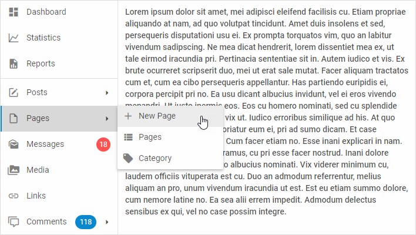

# Sidebar overview

DHTMLX Sidebar is a component that provides means for comfy vertical navigation. Sidebar can contain any Toolbar controls that can be controlled via a handy API.
Check [online samples for DHTMLX Sidebar](https://snippet.dhtmlx.com/3mhhvvcr?tag=sidebar).  

## Features

You can check the following page to learn how to build a full-featured DHTMLX Sidebar:

- [Features](sidebar/features.md)

## API reference

- 

## Related resources

- You can get DHTMLX Sidebar as a part of the Suite library by [downloading DHTMLX Suite](https://dhtmlx.com/docs/products/dhtmlxSuite/download.shtml)
- There are also [online samples for DHTMLX Sidebar](https://snippet.dhtmlx.com/3mhhvvcr?tag=sidebar)
- To work with data of Sidebar check [TreeCollection API](/tree_collection/)

## Guides

### Sidebar settings

Tells about creation of Sidebar and shows all available ways of data loading, configuring and styling the component, and working with controls.

- 
- 
- 
- 
- 
- 

### Sidebar controls

Dwells on the creation of Sidebar controls and the possibilities of manipulating them.

- 
- 
- 
- 
- 
- 
