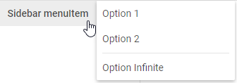

---
sidebar_label: MenuItem
title: MenuItem
---          

MenuItem is a drop-down list of options, can contain its own sub-menu. 

Adding MenuItem
----------------

A menuItem can be easily added to a sidebar with the help of the **add()** method of Tree Collection:

~~~js
sidebar.data.add({
    type:"menuItem", value:"Sidebar menuItem", tooltip: "Press me",  items:[
        { type:"menuItem", value:"Option 1" },
        { type:"menuItem", value:"Option 2" },
        { type:"separator"},
        { type:"menuItem", value:"Option Infinite" }
    ]
});
~~~

### Properties

You can provide the [following properties](sidebar/api/api_menuitem_properties.md) in the configuration object of a MenuItem control.

## Adding an icon

A menuItem can have an icon which is set through the corresponding option **icon**:

~~~js
{
    type:"menuItem", value:"Some",
    icon:"dxi dxi-menu-right"
}
~~~

## Adding a badge with a number

You can add a number badge to the menuItem to display information like the number of new messages. The badge is set via the **count** property:

~~~js
{
    type:"menuItem", value:"Some",
    icon:"dxi dxi-check",
    count:10
}
~~~

## Adding HTML content

You can add any custom HTML content to a menuItem with the help of the **html** property:

~~~js
{
    type: "menuItem",
    html: ""
}
~~~

## Showing/hiding a menuItem

To hide/show a menuItem, you should pass the ID of the menuItem to the **hide() / show()** Sidebar methods:

~~~js
sidebar.show(id);
sidebar.hide(id);
~~~

## Enabling/disabling a navItem 

Any menuItem in the sidebar can be enabled/disabled:

~~~js
sidebar.enable(id);
sidebar.disable(id);
~~~

## Setting tooltip

You can add a tooltip to a menuItem:

~~~js
{
    type:"menuItem", 
    value:"Click", 
    tooltip:"Click me and find out why"  /*!*/
}
~~~

