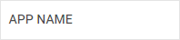

---
sidebar_label: Title
title: Title
---          

This is an item that contains some text.

## Adding Title control

A Title control can be added to a sidebar with the help of the **add()** method of TreeCollection:

~~~js
sidebar.data.add({
    type: "title",
	value: "APP NAME"
});
~~~

### Properties

You can provide the [following properties](sidebar/api/api_title_properties.md) in the configuration object of a Title control.

## Showing/hiding title

Title can be hidden and shown with the help of the related methods. Pass the id of a Title control as a parameter.

~~~js
sidebar.show(id);
sidebar.hide(id);
~~~

## Adding a tooltip

You can add a tooltip to a Title control:

~~~js
{
    type:"title",
    value:"2K",
    tooltip:"Your subscribers"
}
~~~

@todo:
check links to samples and api, add the image 