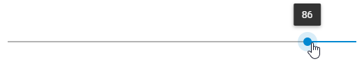
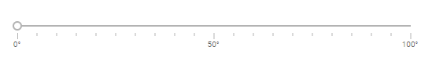
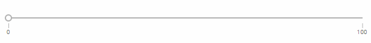
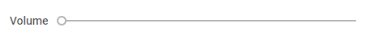
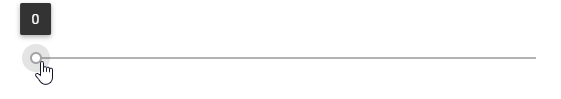

---
sidebar_label: Configuration
title: Configuration
---          

Initial value
---------------

It is possible to define the value the thumb of the slider will be set at on the initialization of the component:

~~~js
var slider = new dhx.Slider("slider_container", { 
    value:20
});
~~~

Inverse mode
------------

You can adjust the configuration of Slider so that its scale would render values in the reverse order, i.e. from the maximal value to the minimal one.

To launch this mode, make use of the  property set to *true*:

~~~js
var slider = new dhx.Slider("slider_container", { 
   inverse:true,
   min: 100,
   max: 0,
   step:1
});
~~~

{{editor	https://snippet.dhtmlx.com/xm8e84s2	Slider. Inverse Mode Of The Slider}}

Minimal and maximal values
------------------------------------------

The minimal and maximal values define the start and end points of the slider. You can specify them via the corresponding configuration properties -  and slider/api/slider_max_config.md. The default values are 0 and 100, correspondingly.

~~~js
var slider = new dhx.Slider("slider_container", { 
    min:1,
    max:150
});
~~~

Range mode
------------------

Besides the standard slider with one thumb, you can create a slider with two thumbs, that is a range slider. For this, you need to use the [range:true](slider/api/slider_range_config.md) option in the slider configuration object and
define an array with the min and max values for the range:

~~~js
var slider = new dhx.Slider("slider", {
    min: 0,
    max: 100,
    value: 0,
    step: 1,
    range: true,     /*!*/
    value: [25, 75]  /*!*/
});
~~~

{{editor	https://snippet.dhtmlx.com/nfdr84oy	Slider. Range Mode Of The Slider}}

There are more details given in the article slider/range_slider.md.

Scale settings
-----------------

You can configure the look and feel of the Slider scale via the corresponding properties of the Slider configuration object:

todotw скорее всего можно просто сослаться на API
{{api
- slider/api/slider_tick_config.md - (<i>number</i>) sets the interval of steps for rendering the slider scale 
- slider/api/slider_majortick_config.md - (<i>number</i>) sets interval of rendering numeric values on the slider scale
- slider/api/slider_ticktemplate_config.md - (<i>function</i>) sets a template for rendering values on the slider scale 
}}

~~~js
var slider = new dhx.Slider("slider_container", { 
   tick: 5,
   majorTick:10,
   tickTemplate: function(major_tick){
        return major_tick + "°";
   } 
});
~~~

{{editor	https://snippet.dhtmlx.com/jsfxnplp	Slider. Custom Scale}}

{{editor	https://snippet.dhtmlx.com/4a6l7cyy	Slider. Slider With A Scale}}

### Showing only the first and the last ticks

In case you want to mark just the minimal and maximal values with ticks, you need to: 

- set the value of the  property equal to the value of the  property
- set the  property to 1

~~~js
var slider = new dhx.Slider("slider", { 
    max:100, min:0, tick:100, majorTick:1
});
~~~

Slider label
-------------

There is a possibility to show a label next to the slider. 

There are two properties that allow manipulating the label of the slider: 

todotw скорее всего можно просто сослаться на API
{{api
-  - specifies the label of a slider
-  - defines the position of a label of a slider: "left"|"top"
}}

~~~js
var slider = new dhx.Slider("slider_container", { 
   label:"Volume",
   // label is rendered on the same level with the trackbar
   labelPosition:"left"
});
~~~

{{editor	https://snippet.dhtmlx.com/4o7yttam	Slider. Slider Label}}

Step  
-----------------

The  option defines the size of each jump between values of the slider. By default, the value of the step is set to 1. You can change this property via the Slider configuration object:

~~~js
var slider = new dhx.Slider("slider_container", { 
    step:2
});
~~~

Tooltip
--------------------

You can specify a tooltip that will display changeable values of the slider when the user moves the slider's thumb. 

There is the  property that enables rendering the slider value over the thumb:

~~~js
var slider = new dhx.Slider("slider_container", { 
    tooltip:true
});
~~~

{{editor	https://snippet.dhtmlx.com/sxh66mnu	Slider. Tooltip For The Slider}}

Vertical mode
---------------

By default, a slider scale is placed horizontally, but you can arrange it vertically via the  property of the Slider configuration object:

~~~js
var slider = new dhx.Slider("slider_container", { 
   mode:"vertical"
});
~~~

{{editor	https://snippet.dhtmlx.com/rjborkca	Slider. Vertical Mode Of The Slider}}

