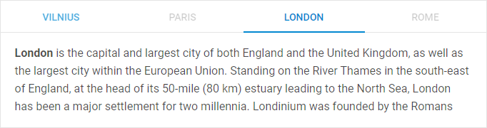
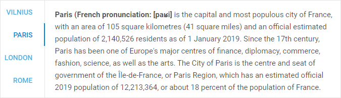
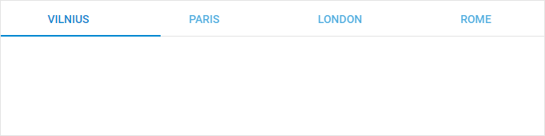
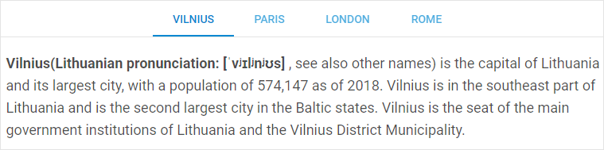

---
sidebar_label: Configuration
title: Configuration
---          

Close buttons for tabs
---------------

{{editor	https://snippet.dhtmlx.com/cysre4v8	Tabbar. Close Button}}

You can equip each Tabbar tab with a close button to make it easily closable via interface. To enable close buttons in all tabs at once, make use of the 
 configuration property:

~~~js
var tabbar = new dhx.Tabbar("tabbar_container", {
    closable:true
});
~~~

You can also add close buttons for separate tabs by setting an array with ids of the tabs as a value for the  property:

~~~js
var tabbar = new dhx.Tabbar("tabbar", {
    closable: ["paris", "london"]
});
~~~

Disabled tabs
------------------

By default, all tabs in Tabbar are enabled. It is possible to make one or several tabs disabled using the  configuration property:

~~~js
// make one tab disabled
var tabbar = new dhx.Tabbar("tabbar_container", {
    disabled: "London"
});
 
// make several tabs disabled
var tabbar = new dhx.Tabbar("tabbar_container", {
    disabled: ["Paris", "Rome"]
});
~~~

{{editor	https://snippet.dhtmlx.com/pxa6rkpj	Tabbar. Disabled Tab}}

Position of tabbar
------------

{{editor	https://snippet.dhtmlx.com/xq6k0tts	Tabbar. Mode}}

When initialized with default settings, Tabbar is located at the top of a page. You can locate dhtmlxTabbar at any desired side of your application by using any other value of the [mode](tabbar/api/tabbar_mode_config.md) property. 
Besides "top", it can also take "bottom","left" or "right" values. e.g.:

~~~js
var tabbar = new dhx.Tabbar("tabbar_container", {
    mode: "left"
});
~~~

Size of tabs
-----------

dhtmlxTabbar allows you to control the height and width of tabs with the help of appropriate configuration options - [tabWidth](tabbar/api/tabbar_tabwidth_config.md) and [tabHeight](tabbar/api/tabbar_tabheight_config.md). By default, they are set to 200px and 45px, correspondingly. This is how you can change the default settings:

~~~js
var tabbar = new dhx.Tabbar("tabbar_container", {
    tabWidth: 190,
    tabHeight: 50
});
~~~

{{editor	https://snippet.dhtmlx.com/yy841z3j	Tabbar. Tab Size}}

Structure of tabs
-------------

The structure of Tabbar should be defined during initialization of the component. It is set within the [views](tabbar/api/tabbar_views_config.md) property. Each tab is an object with attributes, which are:

- <b>id</b> - the id of a tab
- <b>tab</b> - the name of a tab
- <b>tabCss</b> - the name of the CSS class used for a tab
- <b>css</b> - the name of the CSS class used for a cell
- <b>header</b> - the header of a cell
- <b>html</b> - HTML content for a tab
- <b>padding</b> - the distance between the content of a cell and the border of tabbar
- <b>tabWidth</b> - the width of a tab (for more information, see tabbar/api/tabbar_views_config.md)
- <b>tabHeight</b> - the height of a tab (for more information, see tabbar/api/tabbar_views_config.md)

    
~~~js
var tabbar = new dhx.Tabbar("tabbar_container", {
	views:[
		{ tab: "left", css:"panel flex", header:"Left"},
		{ tab: "west", css:"panel flex", header:"West"},
		{ tab: "east", css:"panel flex", header:"East"},
		{ tab: "right", css:"panel flex", header:"Right" }
	]
});
~~~

[Tabbar. Tab size](https://snippet.dhtmlx.com/yy841z3j)

Autosize for tabs
-----------------

When the width or height of tabs are not specified, you can configure the tabs so that their width/height would automatically adjust to the size of the container of Tabbar. For this purpose, make use of the   properties of Tabbar.

~~~js
var tabbar = new dhx.Tabbar("tabbar_container", {
    views:[
        { tab: "left", css:"panel flex", header:"Left"},
        { tab: "west", css:"panel flex", header:"West"},
        { tab: "east", css:"panel flex", header:"East"},
        { tab: "right", css:"panel flex", header:"Right" }
    ],
    tabAutoWidth: true,
    mode: "top"
});
~~~

[Tabbar. Tab auto width](https://snippet.dhtmlx.com/mlzko8am)

[Tabbar. Tab auto height](https://snippet.dhtmlx.com/pqvycp1c)

{{note The  configuration option is used when [mode](tabbar/api/tabbar_mode_config.md) is set to "top" or "bottom", whereas  is applied when [mode](tabbar/api/tabbar_mode_config.md) is set to "right" or "left".}}

Tabs without content 
---------------

It is possible to render a tabbar without any content. Use the [noContent](tabbar/api/tabbar_nocontent_config.md) option for this purpose:

~~~js
var tabbar = new dhx.Tabbar("tabbar_container", {
    noContent:true
});
~~~

{{editor	https://snippet.dhtmlx.com/7jzrifql	Tabbar. Without Content}}

Alignment
------------

Starting from v7.0, there is the ability to set alignment for tabs via the [tabAlign](tabbar/api/tabbar_tabalign_config.md) configuration option of Tabbar:

~~~js
var tabbar = new dhx.Tabbar("tabbar_container", {
    views:[
        { tab: "left", css:"panel flex", header:"Left"},
        { tab: "west", css:"panel flex", header:"West"},
        { tab: "east", css:"panel flex", header:"East"},
        { tab: "right", css:"panel flex", header:"Right" }
    ],
    tabAlign: "center" /*!*/
});
~~~

[Tabbar. Tab align](https://snippet.dhtmlx.com/bctscs71)

The available values of the option are "left" | "start", "center" | "middle", "right" | "end".

