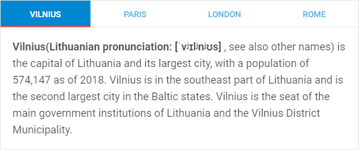

---
sidebar_label: Customization
title: Customization
---          

Styling Tabbar
-----------

There is a possibility to make changes in the look and feel of a tabbar. 

For this you need to take the following steps:

- add a new CSS class(es) with desired settings in the &lt;style&gt; section of your HTML page or in your file with styles (don't forget to include your file on the page in this case)

~~~js

~~~

- specify the name of the created CSS class (or names of classes separated by spaces) as the value of the [css](tabbar/api/tabbar_css_config.md) property in the Tabbar configuration:

~~~js
var tabbar = new dhx.Tabbar({
    css:"my_first_class my_second_class"
});
~~~

{{editor	https://snippet.dhtmlx.com/47en9f0a	Tabbar. Custom Css}}

