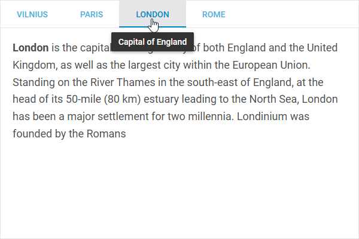

# Customization

## Styling Tabbar

There is a possibility to make changes in the look and feel of a tabbar.

**Related sample**: [Tabbar. Styling (custom CSS)](https://snippet.dhtmlx.com/47en9f0a)

For this you need to take the following steps:

- add a new CSS class(es) with desired settings in the &lt;style&gt; section of your HTML page or in your file with styles (don't forget to include your file on the page in this case)

~~~js

~~~

- specify the name of the created CSS class (or names of classes separated by spaces) as the value of the [css](tabbar/api/tabbar_css_config.md) property in the Tabbar configuration:

~~~js
const tabbar = new dhx.Tabbar("tabbar_container", {
    css:"my_first_class my_second_class"
});
~~~

For example:

~~~html

~~~

## Adding tooltips for tabs

You can add tooltips that will be shown on hovering over Tabbar tabs. 

**Related sample**: [Tabbar. Tooltips on tabs](https://snippet.dhtmlx.com/o5x1e3i8)

These are the steps you need to reproduce:

- initialize a tabbar, specify a custom function that will show tooltips and call the [dhx.tooltip()](/message/api/api_message_properties/#tooltip) method that will create tooltips for tabs inside the function as follows:

~~~jsx
const tabbar = new dhx.Tabbar("tabbar", {
    mode: "top",
    css: "dhx_widget--bordered",
    views: [
        // view objects
    ]
});

function showTooltip(e, text) {
    dhx.tooltip(`Capital of ${text}`, { node: e.target });
};
~~~

- define the logic that will iterate over tabs and call the custom function for showing tooltips, wrap your code into the [dhx.awaitRedraw()](/helpers/await_redraw/) method. It will ensure performing the code inside it as soon as a tab's content is fully rendered:

~~~jsx
dhx.awaitRedraw().then(() => {
    tabbar.forEach(({ id, config }) => {
        document.getElementById(`tab-content-${id}`)
            .addEventListener("mouseover", event => showTooltip(event, config.capital));
    });
});
~~~