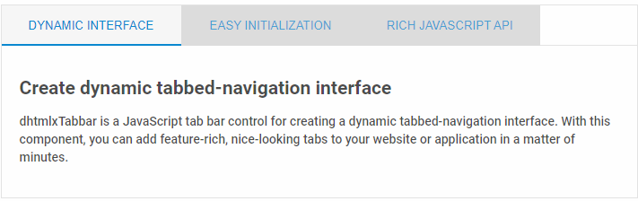

---
sidebar_label: Overview
title: Tabbar overview
description: dhtmlxTabbar is a useful JavaScript widget for handy navigation between tabs which you can easily create and configure. Comprehensive API provides a lot of features for adjusting the tabs to your requirements.
---          

dhtmlxTabbar component allows a user to keep several groups of content together and navigate between them with in a handy way.
Being highly configurable, the component can be easily adjusted to your requirements and will provide quick switching between parts of your app. 
Check [online samples for dhtmlxTabbar](https://docs.dhtmlx.com/suite/samples/tabbar/).

## API reference

- 

## Related resources

- You can get dhtmlxTabbar as a part of the Suite library by [downloading dhtmlxSuite](https://dhtmlx.com/docs/products/dhtmlxSuite/download.shtml)          
- There are also [online samples for dhtmlxTabbar](https://docs.dhtmlx.com/suite/samples/tabbar/)  

## Guides

- 
- 
- 
- 
- 

## Other

- 
