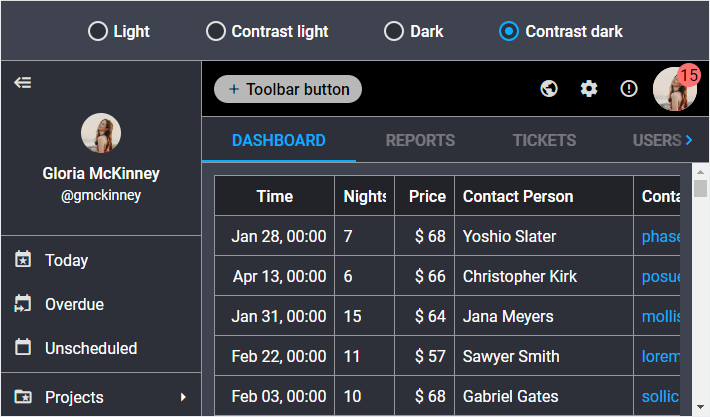

# Dark high contrast theme

The ["contrast-dark"](themes.md#suite-themes) theme is configured both on the base of the [root CSS variables](themes/default_theme.md) and variables which are listed below:

~~~css
[data-dhx-theme='contrast-dark'] {
	/* font */
	--dhx-font-size-normal: 16px;
	--dhx-font-size-small: var(--dhx-font-size-normal);

	--dhx-font-color-primary: var(--dhx-color-white);
	--dhx-font-color-secondary: rgba(255, 255, 255, 0.86);
	--dhx-font-color-additional: var(--dhx-font-color-secondary);
	--dhx-font-color-disabled: rgba(255, 255, 255, .5);
	--dhx-font-color-contrast: var(--dhx-color-black);
	--dhx-font-color-contrast-disabled: var(--dhx-font-color-disabled);
	/* end font */

	/* border */
	--dhx-border-color: rgba(255, 255, 255, 0.5);
	--dhx-border-color-focused: rgba(255, 255, 255, 0.7);
	/* end border */

	/* color scheme */
	--dhx-l-contrast-offset: -12%; /* lightness contrast theme offset */

	--dhx-l-secondary: 60%;

	--dhx-h-background: 226;
	--dhx-s-background: 12%;
	--dhx-l-background: 20%;
	/* end color scheme */

	/* theme colors */
	--dhx-background-primary: hsl(var(--dhx-h-background), var(--dhx-s-background), var(--dhx-l-background));
	--dhx-background-secondary: hsl(var(--dhx-h-background), var(--dhx-s-background), calc(var(--dhx-l-background) + 8%));
	--dhx-background-additional: hsl(var(--dhx-h-background), var(--dhx-s-background), calc(var(--dhx-l-background) + 12%));
	/* end theme colors */

	/* DHTMLX Toolbar service variables*/
	--dhx-s-toolbar-background: var(--dhx-color-black);
	--dhx-s-toolbar-button-background-hover: rgba(255, 255, 255, .07);
	--dhx-s-toolbar-button-background-active: rgba(255, 255, 255, .15);
	/* end DHTMLX Toolbar service variables */

	/* DHTMLX Grid service variables*/
	--dhx-s-grid-header-background: #212329;
	--dhx-s-grid-selection-background: var(--dhx-color-gray-100);
	/* end DHTMLX Grid service variables*/

	/* DHTMLX Calendar service variables*/
	--dhx-s-calendar-muffled: .8;
	/* end DHTMLX Calendar service variables*/

	/* DHTMLX Slider service variables*/
	--dhx-s-tick-font-size: var(--dhx-font-size-small);
	/* end DHTMLX Slider service variables*/
}
~~~