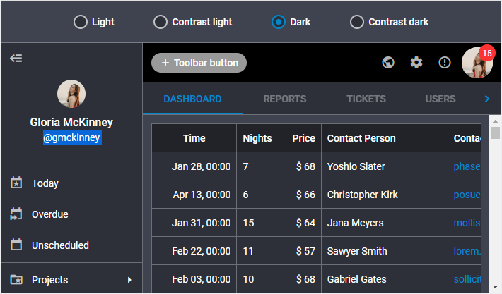

# Dark theme

The ["dark"](themes.md#suite-themes) theme is configured both on the base of the [root CSS variables](themes/default_theme.md) and variables which are listed below:

~~~css
[data-dhx-theme='dark'] {
    /* font */
    --dhx-font-color-primary: var(--dhx-color-white);
    --dhx-font-color-secondary: rgba(255, 255, 255, .7);
    --dhx-font-color-additional: rgba(255, 255, 255, .5);
    --dhx-font-color-disabled: rgba(255, 255, 255, .5);
    --dhx-font-color-contrast: var(--dhx-color-white);
    --dhx-font-color-contrast-disabled: var(--dhx-font-color-disabled);
    /* end font */

    /* border */
    --dhx-border-color: rgba(255, 255, 255, 0.3);
    --dhx-border-color-focused: rgba(255, 255, 255, 0.5);
    /* end border */

    /* color scheme */
    --dhx-l-secondary: 60%; /* lightness contrast theme offset */

    --dhx-h-background: 226;
    --dhx-s-background: 12%;
    --dhx-l-background: 20%;
    /* end color scheme */

    /* theme colors */
    --dhx-background-primary: hsl(var(--dhx-h-background), var(--dhx-s-background), var(--dhx-l-background));
    --dhx-background-secondary: hsl(var(--dhx-h-background), var(--dhx-s-background), calc(var(--dhx-l-background) + 8%));
    --dhx-background-additional: hsl(var(--dhx-h-background), var(--dhx-s-background), calc(var(--dhx-l-background) + 12%));
    /* end theme colors */

    /* DHTMLX Toolbar service variables*/
    --dhx-s-toolbar-background: var(--dhx-color-black);
    --dhx-s-toolbar-button-background-hover: rgba(255, 255, 255, .07);
    --dhx-s-toolbar-button-background-active: rgba(255, 255, 255, .15);
    /* end DHTMLX Toolbar service variables */

    /* DHTMLX Grid service variables*/
    --dhx-s-grid-header-background: #212329;
    --dhx-s-grid-selection-background: var(--dhx-color-gray-100);
    /* end DHTMLX Grid service variables*/
    
    /* DHTMLX Calendar service variables*/
    --dhx-s-calendar-muffled: .6;
    /* end DHTMLX Calendar service variables*/

    /* DHTMLX Slider service variables*/
    --dhx-s-tick-font-size: calc(var(--dhx-font-size-small) / 1.2);
    /* end DHTMLX Slider service variables*/
}
~~~