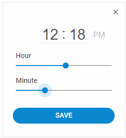
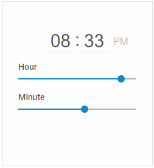

# Configuration

## Actions buttons

The default TimePicker doesn't have any buttons. However, you can add two buttons that will allow you to close the timepicker after selecting necessary time or save the values selected for hour and minutes.
These controls are helpful if you attach TimePicker to an input or a calendar, for example.

There's the  property in the timepicker configuration that while set to *true* enables rendering of the Save button and the Close icon button in the top right corner of the component.

~~~js {2}
var timepicker = new dhx.Timepicker("timepicker_container",{
	controls:true
});
~~~

**Related sample**: [Timepicker. Timepicker With Controls](https://snippet.dhtmlx.com/ybnqq5ej)

## Time format

By default TimePicker displays time in the 24-hour clock format. You can switch to the 12-hour format by setting the  option to *12* in the configuration object of the component.
In this mode the clock inside the timepicker will be shown together with the AM/DM identifier depending on the selected time of the day. 

- 24-hour clock:

~~~js
var timepicker = new dhx.Timepicker("timepicker_container1");
~~~

- 12-hour clock:

~~~js {2}
var timepicker2 = new dhx.Timepicker("timepicker_container2",{
	timeFormat:12
});
~~~

**Related sample**: [Timepicker. 12 Hour Format In Timepicker](https://snippet.dhtmlx.com/u9ge1a4z)

## Initial value

Starting with v7.0, you can set the time value that will appear on initialization of the timepicker. To do that, specify the [value](timepicker/api/timepicker_value_config.md) property in the configuration object of the timepicker. The property can accept a value in the following formats: Date, string, number, array, object. For instance:

~~~js
// the value as a Date 
var timepicker = new dhx.Timepicker("timepicker", {
    value: new Date()
});
 
// the value as a number
var timepicker = new dhx.Timepicker("timepicker", {
    value: 1232151545
});
 
// the value as a string
var timepicker = new dhx.Timepicker("timepicker", {
    value: "22:30"
});
 
// the value as an array
var timepicker = new dhx.Timepicker("timepicker", {
    value: [6,20,"AM"]
});
 
// the value as an object
var timepicker = new dhx.Timepicker("timepicker", {
    value: {hour: 10, minute: 50, AM: true}
});
~~~

**Related sample**: [Timepicker. Value initialization](https://snippet.dhtmlx.com/3d5u4cxx)
