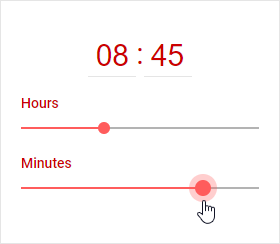

---
sidebar_label: Customization
title: Customization
---          

Styling
----------

There is a possibility to make changes in the look and feel of a timepicker. 

{{editor	https://snippet.dhtmlx.com/n4xfu4e9	Timepicker. Custom Style}}

For this you need to take the following steps:

- add a new CSS class(es) with desired settings in the &lt;style&gt; section of your HTML page or in your file with styles (don't forget to include your file on the page in this case)

~~~html

~~~

- specify the name of the created CSS class (or names of classes separated by spaces) as the value of the [css](timepicker/api/timepicker_css_config.md) property in the TimePicker configuration:

~~~js
var timepicker = new dhx.Timepicker({ 
    css:"my-first-class my-second-class"
});
~~~

