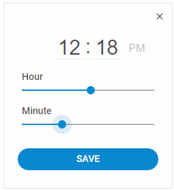

# TimePicker overview

DHTMLX TimePicker is a useful component for selecting time in both 12-hour and 24-hour clock format. Based on Layout and Slider components, it will work smoothly as a part of any DHTMLX-based application. 
Check [online samples for DHTMLX TimePicker](https://snippet.dhtmlx.com/u9ge1a4z?tag=timepicker).

## Features

You can check the following page to learn how to build a full-featured DHTMLX Timepicker:

- [Features](/timepicker/features/)

## API reference

- [Timepicker API overview](/timepicker/api/api_overview/)

## Related resources

- You can get DHTMLX TimePicker as a part of the Suite library by [downloading DHTMLX Suite](https://dhtmlx.com/docs/products/dhtmlxSuite/download.shtml)
- There are also [online samples for DHTMLX TimePicker](https://snippet.dhtmlx.com/u9ge1a4z?tag=timepicker)

## Guides

- [Initialization](/timepicker/initialization/)
- [Configuration](/timepicker/configuration/)
- [Work with TimePicker](/timepicker/usage/)
- [Customization](/timepicker/customization/)
- [Event handling](/timepicker/handling_events/)

## Other

- [Migration to newer versions](/migration/)
