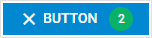

---
sidebar_label: Button
title: Button
---          

This is a simple button that can have an icon. Button can have two states and a badge with a number, which can be useful for displaying the number of new messages, etc.

{{editor	https://snippet.dhtmlx.com/7aysw3gb	Toolbar. Buttons}}

## Adding Button

A button can be easily added to a toolbar with the help of the **add()** method of [Tree Collection](tree_collection/api/refs/treecollection.md):

~~~js
toolbar.data.add({
    type:"button", value:"Best button"
});
~~~

### Properties

You can provide the [following properties](toolbar/api/api_button_properties.md) in the configuration object of a Button control.

## Adding an icon

A button can have an icon which is set through the corresponding option [icon](toolbar__customization.html#icons):

~~~js
{
    type:"button", value:"Done",
    icon:"dxi dxi-check"
}
~~~

## Adding a badge with a number

You can add a number badge to the button to display information like the number of new messages. The badge is set via the **count** property:

~~~js
{
    type:"button", value:"Done",
    icon:"dxi dxi-check",
    count:10
}
~~~

## Adding HTML content

You can add any custom HTML content to a button with the help of the **html** property:

~~~js
{
    type: "button",
    html: "

",
}
~~~

{{editor	https://snippet.dhtmlx.com/5n2b8x84	Toolbar. Item HTML Content}}

## Showing/hiding a button 

To hide/show a button, you should pass the ID of the button to the [hide()](toolbar/api/toolbar_hide_method.md) / [show()](toolbar/api/toolbar_show_method.md) Toolbar methods:

~~~js
toolbar.show(id);
toolbar.hide(id);
~~~

{{editor	https://snippet.dhtmlx.com/cldp89u4	Toolbar. Hide/Show}}

## Enabling/disabling a button 

Any button in the toolbar can be [enabled](toolbar/api/toolbar_enable_method.md)/[disabled](toolbar/api/toolbar_disable_method.md):

~~~js
toolbar.enable(id);
toolbar.disable(id);
~~~

{{editor	https://snippet.dhtmlx.com/ovblenaf	Toolbar. Enable/Disable}}

## Setting tooltip

You can add a tooltip to a button:

~~~js
{
    type:"button", 
    value:"Click", 
    tooltip:"Click me and find out why"  /*!*/
}
~~~

{{editor	https://snippet.dhtmlx.com/105levtd	Toolbar. Tooltips}}

## Two state buttons

You can create buttons with two states: active (pressed) and inactive (unpressed). The activity of a two state button is controlled via the **active** attribute of the Button object:

~~~js
{
    type:"button", 
    value:"Select", 
    twoState:true, active:true  /*!*/
}
~~~

{{editor	https://snippet.dhtmlx.com/1pj4eqw0	Toolbar. Two State}}

### Changing state of a two state button on the fly

The state of a two state button can be changed programmatically with the [setState()](toolbar/api/toolbar_setstate_method.md) method of Toolbar as in:

~~~js
{
    type:"button", twoState:true, value:"Check", id:"check"
}
...
toolbar.setState({"check":true});    // active:true  /*!*/
// or
toolbar.setState({"check":false});   // active:false /*!*/
~~~

**setState()** accepts one parameter: a key-value pair with the ID of the button and the new value.

### Accessing current state of a two state button

The current state of a two state button can be checked with the [getState()](toolbar/api/toolbar_getstate_method.md) method:

~~~js
{
    type:"button", value:"Check", twoState:true, id:"check"
}
...
var state = toolbar.getState(); // -> { check:true } or { check:false } /*!*/
~~~
