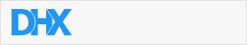

---
sidebar_label: Custom HTML button
title: Custom HTML button
---          

This is an item that contains any custom HTML content (for example, an image, icon or other element).

{{editor	https://snippet.dhtmlx.com/rv3gq5qe	Toolbar. Custom HTML}}

## Adding Custom HTML

Any custom HTML content can be easily added to a toolbar with the help of the **add()** method of [Tree Collection](tree_collection/api/refs/treecollection.md):

~~~js
toolbar.data.add({
	type: "customHTML",
	html: "",
	css: "logo-container"
});
~~~

### Properties

You can provide the [following properties](toolbar/api/api_customhtmlbutton_properties.md) in the configuration object of a Custom HTML control.

## Working with Custom HTML

You can perform operations over the **Custom HTML** item with the help of the available [Toolbar API](toolbar/api/refs/toolbar.md) and [Tree Collection API](tree_collection/api/refs/treecollection.md).
