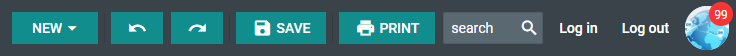

# Customization

## Icons

DHTMLX Toolbar uses the [icons of the DHTMLX library](helpers/icon.md) by default. However, you can use any other icon font pack, if necessary. For this, you need to include the desired icon font on 
a page and apply icons for Toolbar controls.

For example, you can use the [Font Awesome](https://fontawesome.com/) icon pack by including [link to its CDN](https://fontawesome.com/how-to-use/on-the-web/setup/getting-started?using=web-fonts-with-css) 
after the source files of DHTMLX Toolbar as follows:

~~~html

<link rel="stylesheet" href="../../codebase/toolbar.css">

<link rel="stylesheet" href="https://use.fontawesome.com/releases/v5.5.0/css/all.css" 
    integrity="sha384-B4dIYHKNBt8Bc12p+WXckhzcICo0wtJAoU8YZTY5qE0Id1GSseTk6S+L3BlXeVIU" 
    crossorigin="anonymous">
~~~

Then you can use the name of the icon as the value of the **icon** property in the [object with the control parameters](toolbar/load_data.md#json-format-templates) for toolbar:

~~~js
const toolbarData = [
    { type: "button", icon: "fas fa-bold", twoState: true },
    { type: "button", icon: "fas fa-underline", twoState: true },
    { type: "button", icon: "fas fa-italic", twoState: true },
    { type: "button", icon: "fas fa-strikethrough", twoState: true }
];
~~~

**Related sample**: [Toolbar. Custom icons](https://snippet.dhtmlx.com/4aiwvow7)

{{note You can use the [Material Design](https://pictogrammers.com/library/mdi/?welcome) icon pack by including [link to its CDN](https://cdnjs.cloudflare.com/ajax/libs/MaterialDesign-Webfont/2.5.94/css/materialdesignicons.css) in the same way.}}

## Styling 

There is a possibility to make changes in the look and feel of a toolbar. 

**Related sample**: [Toolbar. Styling (custom CSS)](https://snippet.dhtmlx.com/uekgjwsi)

For this you need to take the following steps:

- add a new CSS class(es) with desired settings in the &lt;style&gt; section of your HTML page or in your file with styles (don't forget to include your file on the page in this case)

~~~html

~~~

- specify the name of the created CSS class (or names of classes separated by spaces) as the value of the [css](toolbar/api/toolbar_css_config.md) property in the Toolbar configuration:

~~~js
 
const toolbar = new dhx.Toolbar("toolbar_container", {
    css:"my_first_class my_second_class"
});
~~~

For example:

~~~html

~~~