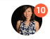

---
sidebar_label: ImageButton
title: ImageButton
---          

This is a button with an image. Unlike toolbar/button.md, it does not have a text label, but can also have a badge with a number and can be two state.

**Related sample**: [Toolbar. Image Button](https://snippet.dhtmlx.com/vdiha09g)

## Adding ImageButton

ImageButton can be easily added to a toolbar with the help of the **add()** method of [Tree Collection](tree_collection/api/treecollection_add_method.md):

~~~js
toolbar.data.add({
    type: "imageButton",
    count: 10,
    src: "../img/avatar.png"
});
~~~

### Properties

You can provide [the following properties](toolbar/api/api_imagebutton_properties.md) in the configuration object of an ImageButton control.

## Working with ImageButton

Just like toolbar/button.md, imageButton can be hidden, disabled and can have a tooltip. You can also manipulate the states of a two state imageButton.

Check the full list of available operations in the [Toolbar API](toolbar/api/api_overview.md) and [Tree Collection API](tree_collection/index.md).
