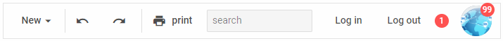

---
sidebar_label: Overview
title: Toolbar overview
description: dhtmlxToolbar is a flexible tool for creating a comfy horizontal navigation bar. Advanced API allows you to easily adjust the structure of the component by combining and customizing diverse types of its controls.
---          

dhtmlxToolbar is a JavaScript component that allows you to keep all main commands and tools of the app in one place and define their look and feel.
Being a great tool for fast and handy navigation, it will make work with your app or website clear and easy. Check [online samples for dhtmlxToolbar](https://docs.dhtmlx.com/suite/samples/toolbar/).

## API reference

- 

## Related resources

- You can get dhtmlxToolbar as a part of the Suite library by [downloading dhtmlxSuite](https://dhtmlx.com/docs/products/dhtmlxSuite/download.shtml)          
- There are also [online samples for dhtmlxToolbar](https://docs.dhtmlx.com/suite/samples/toolbar/)  

## Guides

### Working with Toolbar

Describes the steps of initializing Toolbar and working with it.

-                 
-  
- 
- 
- 

### Toolbar Controls

Discusses the creation of Toolbar controls and the possibilities of manipulating them.

- 
-                                                           
-    
-  
- 
-  
-  
-  
-   
