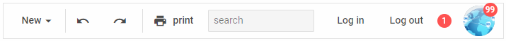

# Toolbar overview

DHTMLX Toolbar is a JavaScript component that allows you to keep all main commands and tools of the app in one place and define their look and feel.
Being a great tool for fast and handy navigation, it will make work with your app or website clear and easy. Check [online samples for DHTMLX Toolbar](https://snippet.dhtmlx.com/nie9tuks?tag=toolbar).

## Features

You can check the following page to learn how to build a full-featured DHTMLX Toolbar:

- [Features](/toolbar/features/)

## API reference

- [Toolbar API overview](/toolbar/api/api_overview/)

## Related resources

- You can get DHTMLX Toolbar as a part of the Suite library by [downloading DHTMLX Suite](https://dhtmlx.com/docs/products/dhtmlxSuite/download.shtml)
- There are also [online samples for DHTMLX Toolbar](https://snippet.dhtmlx.com/nie9tuks?tag=toolbar)
- To work with data of Toolbar check [TreeCollection API](/tree_collection/)

## Guides

### Working with Toolbar

Describes the steps of initializing Toolbar and working with it.

- [Initialization](/toolbar/how_to_start/)
- [Data loading](/toolbar/load_data/)
- [Work with Toolbar](/toolbar/common_methods/)
- [Customization](/toolbar/customization/)
- [Event handling](/toolbar/handling_events/)

### Toolbar controls

Discusses the creation of Toolbar controls and the possibilities of manipulating them.

- [Button](/toolbar/button/)
- [Custom HTML](/toolbar/customhtmlbutton/)
- [Datepicker](/toolbar/datepicker/)
- [ImageButton](/toolbar/image_button/)
- [Input](/toolbar/input/)
- [NavItem](/toolbar/navitem/)
- [SelectButton](/toolbar/selectbutton/)
- [Separator](/toolbar/separator/)
- [Spacer](/toolbar/spacer/)
- [Title](/toolbar/title/)
