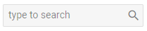

---
sidebar_label: Input
title: Input
---          

This is an input field for entering some text. 

{{editor	https://snippet.dhtmlx.com/ykd0uii1	Toolbar. Input}}

## Adding Input

The following example shows how an Input control can be easily added to a toolbar with the help of the **add()** method of [Tree Collection](tree_collection/api/refs/treecollection.md):

~~~js
toolbar.data.add({
	type:"input",
	value:"",
	placeholder:"Type to search"
});
~~~

### Properties

You can provide [the following properties](toolbar/api/api_input_properties.md) in the configuration object of an Input control.

## Showing/hiding input 

You can show or hide Input with the [show()](toolbar/api/toolbar_show_method.md)/[hide()](toolbar/api/toolbar_hide_method.md) methods of Toolbar:

~~~js
toolbar.show(id);
toolbar.hide(id);
~~~

{{editor	https://snippet.dhtmlx.com/cldp89u4	Toolbar. Hide/Show}}

## Enabling/disabling input

You can also enable and disable inputs with the [enable()](toolbar/api/toolbar_enable_method.md)/[disable()](toolbar/api/toolbar_disable_method.md) methods of Toolbar:

~~~js
toolbar.enable(id);
toolbar.disable(id);
~~~

{{editor	https://snippet.dhtmlx.com/ovblenaf	Toolbar. Enable/Disable}}

## Setting tooltip

You can create a tooltip for an input:

~~~js
{
	type: "input",
	value: "",
	tooltip:"Type to search"
}
~~~

{{editor	https://snippet.dhtmlx.com/105levtd	Toolbar. Tooltips}}

## Setting/getting value

You can use the [setState()](toolbar/api/toolbar_setstate_method.md) and [getState()](toolbar/api/toolbar_getstate_method.md) methods of Toolbar to change and access the value of Input.

To fill in Input with some text, call **setState()** with a key-value pair as a parameter, where the key is the ID of the input and the value is the text:

~~~js
{
	type: "input",
	id:"search",
	value: ""
}
...
toolbar.setState({search:"Summer"});
~~~

To get the text that is currently inside the Input control, call **getState()**:

~~~js
toolbar.getState(); //-> {search:"Summer"}
~~~

Check the full list of available operations in the [Toolbar API](toolbar/api/refs/toolbar.md) and [Tree Collection API](tree_collection/api/refs/treecollection.md).
