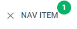

# NavItem

This is a default control for navigation-related components, can contain any other controls as nested items. 

**Related sample**: [Toolbar. NavItem](https://snippet.dhtmlx.com/os48cj6x)

## Adding NavItem

A navItem can be easily added to a toolbar with the help of the **add()** method of [Tree Collection](tree_collection.md).

~~~js
toolbar.data.add({
    type:"navItem", value:"My NavItem"
});
~~~

### Properties

You can provide [the following properties](toolbar/api/api_navitem_properties.md) in the configuration object of a NavItem control.

## Adding an icon

A navItem can have an icon which is set through the corresponding option **icon**:

~~~js
{
    type:"navItem", value:"Some",
    icon:"dxi dxi-check"
}
~~~

## Adding a badge with a number

You can add a number badge to the navItem to display information like the number of new messages. The badge is set via the **count** property:

~~~js
{
    type:"navItem", value:"Some",
    icon:"dxi dxi-check",
    count:10
}
~~~

## Adding HTML content

You can add any custom HTML content to a navItem with the help of the **html** property:

~~~js
{
    type: "navItem",
    html: "

",
}
~~~

**Related sample**: [Toolbar. Item HTML content](https://snippet.dhtmlx.com/5n2b8x84)

## Showing/hiding a navItem

To hide/show a navItem, you should pass the ID of the navItem to the [hide()](toolbar/api/toolbar_hide_method.md) / [show()](toolbar/api/toolbar_show_method.md) Toolbar methods:

~~~js
toolbar.show(id);
toolbar.hide(id);
~~~

**Related sample**: [Toolbar. Hide / show items](https://snippet.dhtmlx.com/cldp89u4)

## Enabling/disabling a navItem

You can also enable and disable any navItem with the [enable()](toolbar/api/toolbar_enable_method.md)/[disable()](toolbar/api/toolbar_disable_method.md) methods of Toolbar:

~~~js
toolbar.enable(id);
toolbar.disable(id);
~~~

**Related sample**: [Toolbar. Enable / disable items](https://snippet.dhtmlx.com/ovblenaf)

## Setting tooltip

You can add a tooltip to a navItem:

~~~js {4}
{
    type:"navItem", 
    value:"Click", 
    tooltip:"Click me and find out why"
}
~~~

**Related sample**: [Toolbar. Tooltips](https://snippet.dhtmlx.com/105levtd)

## Two state NavItems

You can create navItems with two states: active (pressed) and inactive (unpressed). The activity of a two state navItem is controlled via the **active** attribute of the navItem object:

~~~js {5}
{
    type: "navItem",
    icon: "dxi dxi-format-bold",
    tooltip: "bold text",
    twoState: true, active: false
}
~~~

**Related sample**: [Toolbar. TwoState](https://snippet.dhtmlx.com/1pj4eqw0)

### Changing state of a two state navItem on the fly

The state of a two state item can be changed programmatically with the [setState()](toolbar/api/toolbar_setstate_method.md) method of Toolbar as in:

~~~js {7,9}
{
    type: "navItem", icon: "dxi dxi-format-bold",
    tooltip: "bold text", twoState: true, 
	id:"bold"
}
...
toolbar.setState({"bold":true});    // active:true
// or
toolbar.setState({"bold":false});   // active:false
~~~

**setState()** accepts one parameter: a key-value pair with the ID of the item and the new value.

### Accessing current state of a two state navItem

The current state of a two state item can be checked with the [getState()](toolbar/api/toolbar_getstate_method.md) method:

~~~js {7}
{
    type: "navItem", icon: "dxi dxi-format-bold",
    tooltip: "bold text", twoState: true, 
	id:"bold"
}
...
const state = toolbar.getState(); // -> { bold:true } or { bold:false }
~~~
