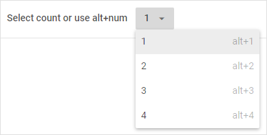

---
sidebar_label: SelectButton
title: SelectButton
---          

This is a button that contains a drop-down list of options.

{{editor	https://snippet.dhtmlx.com/nqq5ej8w	Toolbar. Select Button}}

## Adding SelectButton

A new SelectButton can be created with the help of the **add()** method of [Tree Collection](tree_collection/api/refs/treecollection.md):

~~~js
toolbar.data.add(
	{
		id: "title",
    	value: "Select count or use alt+num"
	},
	{
   		id: "currentButton",
    	type: "selectButton",
    	value: "1",
    	items: [
      		{
        		value: "1",
        		hotkey: "alt+1"
      		},
      		{
        		value: "2",
        		hotkey: "alt+2"
      		},
      		{
        		value: "3",
        		hotkey: "alt+3"
      		},
      		{
        		value: "4",
        		hotkey: "alt+4"
      		}
    	]
	}
);
~~~

### Properties

The configuration object of the SelectButton control can have [the following properties](toolbar/api/api_selectbutton_properties.md).

##  Operations with a button

You can perform operations over the SelectButton control with the help of the available [Toolbar API](toolbar/api/refs/toolbar.md) and [Tree Collection API](tree_collection/api/refs/treecollection.md).
