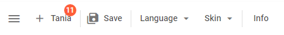

---
sidebar_label: Separator
title: Separator
---          

This is a horizontal (between menu options) or vertical (between toolbar controls) line separating items/groups of items from each other.

{{editor	https://snippet.dhtmlx.com/sguwr3m9	Toolbar. Separator}}

## Adding Separator

A new Separator can be created with the help of the **add()** method of [Tree Collection](tree_collection/api/refs/treecollection.md):

~~~js
toolbar.data.add({
	type:"separator"
});
~~~

### Properties

The configuration object of the Separator control can have [the following properties](toolbar/api/api_separator_properties.md).

## Showing/hiding separator

You can hide and show Separator with the [show()](toolbar/api/toolbar_show_method.md)/[hide()](toolbar/api/toolbar_hide_method.md) methods of Toolbar by passing the control's id to them:

~~~js
toolbar.show(id);
toolbar.hide(id);
~~~

{{editor	https://snippet.dhtmlx.com/cldp89u4	Toolbar. Hide/Show}}

Check the full list of available operations in the [Toolbar API](toolbar/api/refs/toolbar.md) and [Tree Collection API](tree_collection/api/refs/treecollection.md).
