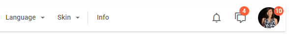

---
sidebar_label: Spacer
title: Spacer
---          

This item takes space on the toolbar and is used for aligning controls.

**Related sample**: [Toolbar. Spacer](https://snippet.dhtmlx.com/0wt6z7sc)

## Adding Spacer

A new Spacer can be created with the help of the **add()** method of [Tree Collection](tree_collection/api/treecollection_add_method.md):

~~~js
toolbar.data.add({
	type:"spacer"
});
~~~

### Properties

You can provide [the following properties](toolbar/api/api_spacer_properties.md) in the configuration object of a Spacer control.

## Showing/hiding spacer

You can hide and show Spacer with the [show()](toolbar/api/toolbar_show_method.md)/[hide()](toolbar/api/toolbar_hide_method.md) methods of Toolbar:

~~~js
toolbar.show(id);
toolbar.hide(id);
~~~

**Related sample**: [Toolbar. Hide/Show](https://snippet.dhtmlx.com/cldp89u4)

Check the full list of available operations in the [Toolbar API](toolbar/api/api_overview.md) and [Tree Collection API](tree_collection/index.md).
