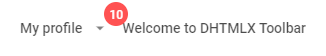

---
sidebar_label: Title
title: Title
---          

This is an item that contains some text.

{{editor	https://snippet.dhtmlx.com/dwynhb7o	Toolbar. Title}}

## Adding Title control

A Title control can be added to a toolbar with the help of the **add()** method of [Tree Collection](tree_collection/api/refs/treecollection.md):

~~~js
toolbar.data.add({
    type: "title",
	value: "APP NAME"
});
~~~

### Properties

You can provide [the following properties](toolbar/api/api_title_properties.md) in the configuration object of a Title control.

## Showing/hiding title

Title can be hidden and shown with the help of the [show()](toolbar/api/toolbar_show_method.md)/[hide()](toolbar/api/toolbar_hide_method.md)  methods. Pass the id of a Title control as a parameter.

~~~js
toolbar.show(id);
toolbar.hide(id);
~~~

{{editor	https://snippet.dhtmlx.com/cldp89u4	Toolbar. Hide/Show}}

## Adding a tooltip

You can add a tooltip to a Title control:

~~~js
{
    type:"title",
    value:"2K",
    tooltip:"Your subscribers"
}
~~~

{{editor	https://snippet.dhtmlx.com/105levtd	Toolbar. Tooltips}}
