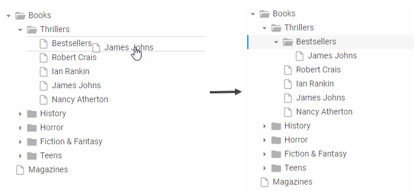
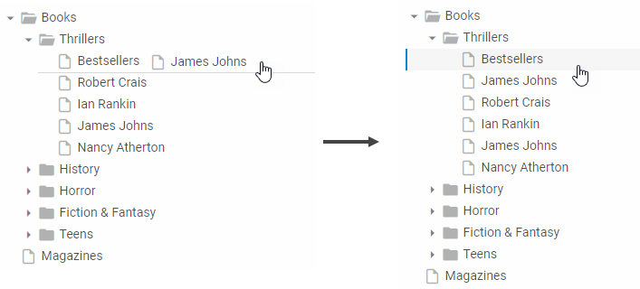

---
sidebar_label: dropBehaviour
title: dropBehaviour
---          

@short: defines the behaviour of a dragged item

@signature: dropBehaviour?: "child" | "sibling" | "complex";

@example: 
var source = new dhx.Tree("tree-source",{dragMode:"source", dropBehaviour:"complex"});
var target = new dhx.Tree("tree-target",{dragMode:"target", dropBehaviour:"complex"});

@template:	api_config
@descr: 
{{note Don't forget to enable drag-n-drop via the  property to use dropBehaviour.}}

There are three modes of behaviour of a dragged tree item, depending on the value set for the **dropBehaviour** option in the configuration object of a tree:

- "child" - a dragged item becomes a child of the item it is dragged to

- "sibling" - a dragged item becomes a sibling of the item it is dragged to

- "complex" - a dragged item can become both a child or a sibling of a target item, depending on the position specified by highlighting (check the above images)

@relatedsample: https://snippet.dhtmlx.com/80mh3hly	Tree. Drop Behaviour

@related: tree/initialization_of_dhtmlxtree.md#initializetree
tree/drag_and_drop_handling.md#dropbehaviour
