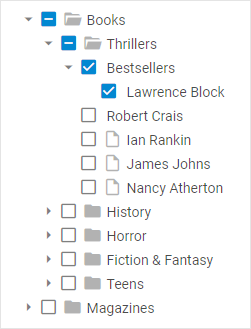
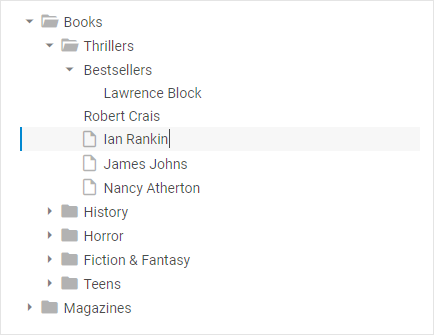
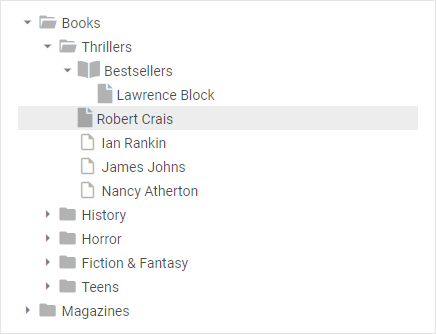

# Configuration

## Checkboxes for items

dhtmlxTree provides enhanced system of checkbox manipulations. In addition to standard two-state checkboxes that allow check/uncheck tree items, it also uses three-state checkboxes that include an intermediate state, 
when just some children of a parent item are checked.

In order to enable checkboxes for items, make use of the  configuration option:

~~~js
var tree = new dhx.Tree("tree_container", {checkbox: true});
~~~

**Related sample**: [Tree. Checkboxes For Items](https://snippet.dhtmlx.com/hgsivvpb)

## Editing of items

It is possible to enable editing of the text of Tree items before initialization of the component using the  configuration property:

~~~js
var tree = new dhx.Tree("tree_container", {editable: true});
~~~

**Related sample**: [Tree. Editable](https://snippet.dhtmlx.com/re4h88w7)

## Key navigation

You can switch on key navigation in a tree with the  property before initialization of the component: 

~~~js
var tree = new dhx.Tree("tree_container", {keyNavigation: true});
~~~

After that you need to select any item and then apply Arrow keys:

<table>
	<tbody>
        <tr>
			<td><b>Up arrow key</b></td>
			<td>to move selection to the item above the currently selected one</td>
		</tr>
        <tr>
			<td><b>Down arrow key</b></td>
			<td>to move selection to the item below the currently selected one</td>
		</tr>
        <tr>
			<td><b>Right arrow key</b></td>
			<td>to open a selected folder</td>
		</tr>
        <tr>
			<td><b>Left arrow key</b></td>
			<td>to close a selected opened folder</td>
		</tr>
    </tbody>
</table>

**Related sample**: [Tree. Key Navigation](https://snippet.dhtmlx.com/icql8fwq)

## Selection of items

**Related sample**: [Tree. Disable Selection](https://snippet.dhtmlx.com/2x9htpke)

The default configuration of Tree provides you with the selection feature that allows highlighting a Tree item. To disable selection in a Tree you need to set the  configuration property to *false*:

~~~js
const tree = new dhx.Tree("tree_container", {
    selection: false,
});
~~~
