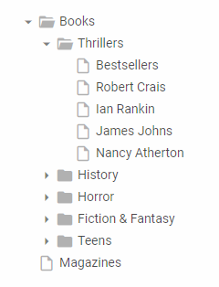

---
sidebar_label: Overview
title: Tree overview
description: dhtmlxTree is a JavaScript component used to create smart and feature-rich hierarchical trees.
---          

dhtmlxTree is a nice JavaScript tree component intended for making intuitive hierarchical navigation interfaces for web applications. 
The component provides smart drag-and-drop, dynamic rendering of items, handy key navigation, customizable appearance, and other useful features. 
Check [online samples for dhtmlxTree](https://docs.dhtmlx.com/suite/samples/tree/). 

## API Reference

- 

## Related resources

- To get just dhtmlxTree, download it from [our website](https://dhtmlx.com/docs/products/dhtmlxTree/download.shtml)
- To get the whole JavaScript library of UI components [download dhtmlxSuite](https://dhtmlx.com/docs/products/dhtmlxSuite/download.shtml)          
- There are also [online samples for dhtmlxTree](https://docs.dhtmlx.com/suite/samples/tree/)    
  
## Guides

- 
-    
- 
- 
- 
- 
- 								
- 
     
## Other

- 
