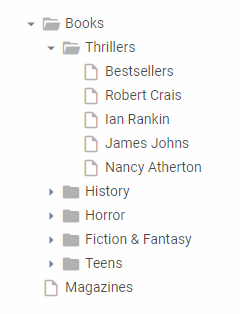

# Tree overview

DHTMLX Tree is a nice JavaScript tree component intended for making intuitive hierarchical navigation interfaces for web applications.
The component provides smart drag-and-drop, dynamic rendering of items, handy key navigation, customizable appearance, and other useful features.
Check [online samples for DHTMLX Tree](https://snippet.dhtmlx.com/hg3f50td?tag=tree).

## Features

You can check the following page to learn how to build a full-featured DHTMLX Tree:

- [Features](/tree/features/)

## API Reference

- [Tree API overview](/tree/api/api_overview/)

## Related resources

- To get just DHTMLX Tree, download it from [our website](https://dhtmlx.com/docs/products/dhtmlxTree/download.shtml)
- To get the whole JavaScript library of UI components [download DHTMLX Suite](https://dhtmlx.com/docs/products/dhtmlxSuite/download.shtml)
- There are also [online samples for DHTMLX Tree](https://snippet.dhtmlx.com/hg3f50td?tag=tree)
- To work with data of Tree check [TreeCollection API](/tree_collection/)

## Guides

- [Initialization](/tree/initialization_of_dhtmlxtree/)
- [Configuration](/tree/configuration/)
- [Data loading](/tree/loading_data/)
- [Drag-n-Drop](/tree/drag_and_drop_handling/)
- [Work with Tree](/tree/work_with_tree/)
- [Work with Selection object](/tree/usage_selection/)
- [Customization](/tree/setting_tree_appearance/)
- [Event handling](/tree/events_handling/)

## Other

- [Migration to newer versions](/migration/)
