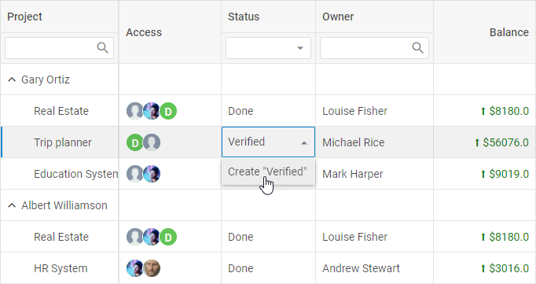

# Configuration

dhtmlxTreeGrid possesses flexible configuration that let you get desired look and feel via a collection of versatile properties.

## Columns

It is possible to adjust the configuration of grid columns via the corresponding [](treegrid/api/treegrid_columns_config.md) option. As a value it takes an array with objects each of which contains config of a column.
The full list of properties you can set for a column is given in the API reference.

~~~js
const treegrid = new dhx.TreeGrid("treegrid_container", {
    columns: [
        { width: 100, id: "a", header: [{ text: "#" }] },
        { width: 100, id: "b", header: [{ text: "Title" }] },
        { width: 200, id: "c", header: [{ text: "Name" }] },
        { width: 200, id: "d", header: [{ text: "Address" }] }
    ],
    data: dataset
});
~~~

**Related sample**: [TreeGrid. Initialization with config.data](https://snippet.dhtmlx.com/kob9385v)

Each column object may contain a set of properties. You will find the full list of the configuration properties of a TreeGrid column [here](treegrid/api/api_treegridcolumn_properties.md).

## Alignment

Starting from v6.5, there is the ability to align data in a column as well as to align data in the column's header via the **align** option:

~~~js
const treegrid = new dhx.TreeGrid("treegrid_container", {
    columns: [
        { id: "name", header:  [{ text: "Name", align: "center" }], align: "right"} 
        // more options
    ],
    data: dataset
});
~~~

**Related sample**: [TreeGrid. Content align](https://snippet.dhtmlx.com/g38rr3so)

The available values of the option are "left", "center" and "right".

## Autosize for columns

You can configure columns' settings so that their width would automatically adjust to their content. Use the [](treegrid/api/treegrid_adjust_config.md) property for this purpose. The property can take one of 4 values:

<table>
	<tbody>
        <tr>
			<td><b>"header"</b></td>
			<td>adjusts the columns to the width of their header</td>
		</tr>
        <tr>
			<td><b>"footer"</b></td>
			<td>adjusts the columns to the width of their footer</td>
		</tr>
        <tr>
			<td><b>"data"</b></td>
			<td>adjusts the columns to the width of their content</td>
		</tr>
        <tr>
			<td><b>true</b></td>
			<td>combines the above mentioned modes and adjusts the column to the bigger value</td>
		</tr>
    </tbody>
</table>
<br/>

~~~js
const treegrid = new dhx.TreeGrid("treegrid_container", {
    columns: [  
        // columns config
    ], 
    adjust: "header", 
    data: dataset
});
~~~

**Related sample**: [TreeGrid. Adjust columns by header, data, all](https://snippet.dhtmlx.com/lgvoz0ar)

It is also possible to set the [](treegrid/api/treegrid_adjust_config.md) property in the configuration of a separate column:

~~~js
const treegrid = new dhx.TreeGrid("treegrid_container", { 
    columns: [
        { id: "country", header: [{ text: "Country" }], adjust: "header" }, 
        { id: "population", header: [{ text: "Population" }] }
    ],
    adjust: false, 
    data: dataset
});
~~~

## Autoheight for rows

Starting from v7.1, you can set the [autoHeight:true](treegrid/api/treegrid_autoheight_config.md) option in the configuration of TreeGrid to make long text to split into multiple lines automatically based on the width of the column:

~~~js
const treegrid = new dhx.TreeGrid("treegrid_container", {
	columns: [  
        // columns config
    ], 
	autoHeight: true, 
	data: dataset
});
~~~

**Related sample**: [TreeGrid. Rows auto height](https://snippet.dhtmlx.com/4158ftak)

As a result, the height of the cells will automatically adjust to their content.

Note, that the **autoHeight** option does not adjust the height in the cells of the header/footer of TreeGrid. The option just makes their text to split into multiple lines, but the height of the cells will remain the same. To set the height of the rows in the header/footer, you should apply the [](treegrid/api/treegrid_headerrowheight_config.md) and [](treegrid/api/treegrid_footerrowheight_config.md) configuration options of TreeGrid.

## Autowidth for columns

It is possible to adjust the size of TreeGrid columns to the size of TreeGrid with the help of the [](treegrid/api/treegrid_autowidth_config.md) configuration option, like this:

~~~js
const treegrid = new dhx.TreeGrid("treegrid_container", {
    columns: [ 
        // columns config
    ], 
    autoWidth: true, 
    data: dataset
});
~~~

**Related sample**: [TreeGrid. Columns auto width](https://snippet.dhtmlx.com/irybslog)

You can disable this functionality for a specified column via setting the [](treegrid/api/treegrid_autowidth_config.md) property to *false* in the configuration of the column:

~~~js
const treegrid = new dhx.TreeGrid("treegrid_container", {
	columns: [
		{ width: 200, id: "country", header: [{ text: "Country" }], autoWidth: false }, 
		{ width: 150, id: "population", header: [{ text: "Population" }] },
	],
	autoWidth: true, 
	data: dataset
});
~~~

## Data

You can specify data for your grid before initialization via the [](treegrid/api/treegrid_data_config.md) configuration property. There are also API methods for loading data into grid on the fly. Check the details in the [](treegrid/data_loading.md) article.

~~~js
const treegrid = new dhx.TreeGrid("treegrid_container", {
    columns: [  
        // columns config
    ], 
    data: dataset 
});
~~~

**Related sample**: [TreeGrid. Initialization with config.data](https://snippet.dhtmlx.com/kob9385v)

## Drag-n-drop inside the grid

There is the ability to reorder rows and columns by drag and drop in TreeGrid. To enable the functionality, define the [dragItem: "both"](treegrid/api/treegrid_dragitem_config.md) property in the configuration object of TreeGrid:

~~~js {5}
const treegrid = new dhx.TreeGrid("treegrid_container", {
    columns: [  
        // columns config
    ], 
    dragItem:"both",   
    data: dataset
});
~~~

To activate the functionality for columns or rows separately, set the value of **dragItem** to *"column"* or *"row"* respectively.

If needed, you can disable the drag-n-drop functionality for a separate column via the **draggable** configuration option of the column:

~~~js {3}
const treegrid = new dhx.TreeGrid("treegrid_container", {
    columns: [
        { width: 200, id: "name", header: [{ text: "Name" }], draggable: false }, 
        { width: 260, id: "native", type: "string", header: [{ text: "Native name" }] },
        { width: 200, id: "currency", type: "string", header: [{ text: "Currency" }] } 
    ],
    data: dataset,
    dragItem: "column",    
});
~~~

**Related sample**: [TreeGrid. Drag-n-drop](https://snippet.dhtmlx.com/ax5vs4a8)

{{note To make the process of working with drag and drop more flexible, you can apply the related drag-n-drop events of TreeGrid for [columns](treegrid/api/api_overview.md#column-drag-and-drop) and [rows](treegrid/api/api_overview.md/#row-drag-and-drop).}}

## Drag-n-drop between grids

dhtmlxTreeGrid supports drag-n-drop of rows between grids in several modes. To begin with, you should specify the [](treegrid/api/treegrid_dragmode_config.md) property in the configuration object of TreeGrid. Then define which mode you need:

- "target" - a grid takes rows from other grids, while its row can't be dragged out of it
- "source" - a grid allows dragging its rows out and can't take rows from other grids
- "both" - a grid both takes rows from other grids and allows dragging its rows out as well

~~~js {7}
const treegrid = new dhx.TreeGrid("treegrid_container", { 
    columns: [
        { id: "country", header: [{ text: "Country" }] },
        { id: "population", header: [{ text: "Population" }] }
    ],
    data: dataset,
    dragMode: "source"
});
~~~

**Related sample**: [TreeGrid. Drag-n-drop between grids](https://snippet.dhtmlx.com/43covmy2)

## Editing TreeGrid and separate columns

dhtmlxTreeGrid provides the editing feature that includes two options:

- editing of the whole TreeGrid, i.e. of all its columns

To make all columns of the TreeGrid editable, specify the [](treegrid/api/treegrid_editable_config.md) option in the configuration of TreeGrid:

~~~js
const treegrid = new dhx.TreeGrid("treegrid_container", {
	columns: [  
        // columns config
    ], 
	data: data,
	editable: true 
});
~~~

**Related sample**: [TreeGrid. Editing with different editors (multiselect, combobox, select, boolean, date)](https://snippet.dhtmlx.com/sdbfbv2n)

- editing of the specified columns only

This option implies that you can enable/disable editing of particular columns by setting the **editable: true** property in the configuration of a column:

In the example below all columns will be editable, except for the first one:

~~~js
const treegrid = new dhx.TreeGrid("treegrid_container", {
	columns: [
		{ 
        	width: 150, id: "project",
            editable: false, 
            header: [
        	  {text: "Project"}, {content: "selectFilter"}
            ]
        },
		{ width: 150, id: "owner", header: [{text: "Owner"},{content: "inputFilter"}]},
		{ width: 150, id: "hours", header: [{text: "Hours"}, {content: "inputFilter"}]},
		// more columns
	],
	data: data,
	editable: true
});
~~~

And the following example demonstrates an opposite situation when only the first column is editable:

~~~js
const treegrid = new dhx.TreeGrid("treegrid_container", {
	columns: [
		{ 
           width: 150, id: "project",
           editable: true,
           header: [
        	{text: "Project"}, {content: "selectFilter"}
           ]
        },
		{ width: 150, id: "owner", header: [{text: "Owner"},{content: "inputFilter"}]},
		{ width: 150, id: "hours", header: [{text: "Hours"}, {content: "inputFilter"}]},
		// more columns
	],
	data: data
});
~~~

### Setting type of column editor

You can specify the way of editing the cells of a TreeGrid column depending on its content. The type of the used editor can be defined either by the **editorType** or via the **type** property of a column.

There are several types of column editors:

- **input** - an editor for cells with a simple text (the default one, unless a column has **type:"date"**)

~~~js
// cells of the "project" column will be edited as inputs
const treegrid = new dhx.TreeGrid("treegrid_container", {
	columns: [
		{
			width: 150,
			id: "project",
			header: [{ text: "Project" }, { content: "selectFilter" }]
		}
        // more columns
	],
	data: data,
	editable: true
});
~~~

- **datePicker** - an editor for cells with dates (default for a column with **type:"date"**)

To use this editor, you should specify the **type:"date"** property for a column. It is also possible to set the necessary [format of date](calendar/api/calendar_dateformat_config.md) while editing a cell content with the help of the **format** option.

~~~js
{ 
	// if the type:"date" config is set in the column config, 
    // there's no need to specify the type of the editor
	width: 150, id: "start_date", 
    header: [{ text: "Calendar", colspan: 2 }, { text: "Start date" }], 
    type: "date", format: "%d/%m/%Y" 
}
~~~

- **select** - an editor for cells that should contain several options to choose from

To set this editor type you need to provide the **options** property with an array of options to be displayed in the editor, e.g.:

~~~js
{
	width: 150, id: "status", header: [{text: "Status"}, {content: "selectFilter"}],
	editorType: "select", options: ["Done", "In Progress", "Not Started"]
} 
~~~

Or provide the **options** property with an array of objects with a set of *key:value* pairs - attributes of options and their values.

- The **id** attribute sets the id for the option;
- The **value** attribute sets the value to be displayed both in the editor and in the grid cell. If the id of the option is specified in the data set, the value will also be displayed in the cell on TreeGrid initialization.

~~~js
{
    width: 150, id: "status", header: [{text: "Status"}, {content: "selectFilter"}],
    editorType: "select", 
	options: [
		{ id: "done", value: "Done" }, 
		{ id: "in progress", value: "In Progress" }, 
		{ id: "not started", value: "Not Started" },
	],
}
~~~

**Related sample**: [TreeGrid. Editing with different editors (multiselect, combobox, select, boolean, date)](https://snippet.dhtmlx.com/sdbfbv2n)

- **checkbox** - an editor for cells with a two-state check box

To use this editor, you need to specify the **type: "boolean"** property for a column.

~~~js
{ 
	// if the type:"boolean" config is set in the column config, 
    // there's no need to specify the type of the editor
	width: 160, id: "test", 
    header: [{ text: "Test" }], 
    type: "boolean" 
}
~~~

**Related sample**: [TreeGrid. Editing with different editors (multiselect, combobox, select, boolean, date)](https://snippet.dhtmlx.com/sdbfbv2n)

{{note If you specify the **editable** option in the configuration of TreeGrid, then editing of a column with checkbox will always be enabled.}}

- **combobox** - an editor for cells that should contain several options to choose from. There is a possibility to find an option by entering text in the edit control

To use this editor you need to specify the **editorType: "combobox"** property for a column and provide the **options** property with an array of options to be displayed in the editor, e.g.:

~~~js
{
    width: 160, id: "test", header: [{ text: "Test" }], type: "string", 
    editorType: "combobox", options: ["1 time", "1-2 times", "more than 5 times"]
}
~~~

Or provide the **options** property with an array of objects with a set of *key:value* pairs - attributes of options and their values.

- The **id** attribute sets the id for the option;
- The **value** attribute sets the value to be displayed both in the editor and in the grid cell. If the id of the option is specified in the data set, the value will also be displayed in the cell on TreeGrid initialization.

```js
{
    width: 160, id: "test", header: [{ text: "Test" }], type: "string", 
    editorType: "combobox", 
	options: [
		{ id: "1 time", value: "1" }, 
		{ id: "1-2 times", value: "1-2 " }, 
		{ id: "more than 5 times", value: "5+" }
	]  
}
```

**Related sample**: [TreeGrid. Editing with different editors (multiselect, combobox, select, boolean, date)](https://snippet.dhtmlx.com/sdbfbv2n)

- **textarea** - an editor for cells that contain text

To use this editor, you should specify the **editorType:"textarea"** property for a column.

The **textarea** editor allows editing multiple lines of text when the [autoHeight:true](treegrid/api/treegrid_autoheight_config.md) configuration option of TreeGrid is enabled.

~~~js
const treegrid = new dhx.TreeGrid("treegrid_container", {
	columns: [
		{
			id: "name", header: [{ text: "Book Name" }], gravity: 1.5, 
			editorType: "textarea" 
		},
        // more columns
	],
	data: data,
	editable: true,
	autoHeight: true 
});
~~~

- **multiselect** - an editor for cells that enables selection of multiple options. You can select one option, several options, all options, or no options

```js
const treegrid = new dhx.TreeGrid("treegrid_container", {
    columns: [
        {
            id: "renewals", type: "string",
            header: [{ text: "Number of renewals" }],
            editorType: "multiselect",
            options: ["1 time", "1-2 times", "more than 5 times"],
        },
        // more columns
    ],
    data: data,
});
```

**Related sample**: [TreeGrid. Editing with different editors (multiselect, combobox, select, boolean, date)](https://snippet.dhtmlx.com/sdbfbv2n)

If you use the **multiselect** editor, you can predefine several options to be shown in a cell. You should separate the options in the dataset using the `,` separator.

```js
const data = [
    {
        renewals: "1 time" // one option is shown in a cell
        ...
    },
    {
        renewals: "more than 5 times, 1 time" // two options are shown in a cell
        ...
    }
];
```

### Editable combobox

From v7.3, you may allow end users to add new options into the combobox editor ([editorType: "combobox"](#setting-type-of-column-editor)) from UI. To activate the functionality, specify the **newOptions: true** attribute of the **editorConfig** property in the configuration of the [column](treegrid/api/api_treegridcolumn_properties.md):

~~~js {7}
{
    width: 120,
    id: "status",
    header: [{ text: "Status" }, { content: "selectFilter" }],
    editorType: "combobox",
    // enables the ability to add new values into the combobox editor of the "Status" column
    editorConfig: { newOptions: true }, 
    options: ["Done", "In Progress", "Not Started"]
},
~~~

**Related sample:** [TreeGrid. Rich example with templates and different editors](https://snippet.dhtmlx.com/0gd4dn8p)

The new option will be added into the combobox after the user types a new value into the input field and either presses "Enter" or clicks on the appeared *Create "newValue"* option in the drop-down list.



At the same time, the created option will also appear in the drop-down list of the header/footer filters ([content: "selectFilter" | "comboFilter"](#headerfooter-content)) of the column.


> To localize the *Create* option, translate the corresponding string and apply a ready locale to the Combobox component:

~~~js
const locale = {
  	en: {
    	createItem: "Create"
  	},
  	de: {
    	createItem: "Schaffen"
  	}
};

dhx.i18n.setLocale("combobox", locale["de"]);
~~~

### Opening editor with one click

By default, you can open the editor by double-clicking on a cell. But if you need the editor to open after a single click, apply the [](treegrid/api/treegrid_cellclick_event.md) event of the treegrid.

{{note Note, that it does not work for the select editor (*editorType: "select"*) and you need to use the combobox editor (*editorType:"combobox"*) if you want a drop-down list to open on the mouse click.}}

## Formatting columns

Starting from v7.1, you can display the values of the cells of a TreeGrid column in the desired format:

1\. To define the format for numeric values, apply the **format** configuration option of the column:

~~~js
{ 
	width: 150, id: "price", header: [{ text: "Price" }],  
	type: "number", format: "# #.000" 
}
// -> 4564.2 will be displayed as 4 564.200
~~~

The following characters can be used:

- **#** - the integer part of the number
- **0** - the fractional part of the number. The **0** placeholder displays insignificant zeros if a number has fewer digits than there are zeros in the format string, for instance, the **.00** format will display 0.298 as 0.30. <br>If a number has more digits to the right of the decimal point than there are placeholders in the format string, the number rounds to as many decimal places as there are placeholders, for instance, the **.000** format will display 0.2 as 0.200.
- **# #** - sets the thousands separator in a number (123 456)
- **#.0** - sets the separator for the decimal point in a number (123 456.357)

2\. You can display the percentage value in the necessary format by setting the **type: "percent"** configuration option of a column together with the **format** option:

~~~js
{ 
	width: 150, id: "inStock", header: [{ text: "In stock" }], 
	type: "percent", format: "#.00" 
}
// -> 0.0039 will be displayed as 0.39%
~~~

When using just the **type: "percent"** configuration option of a column, the result will be the following:

~~~js
{ 
	width: 150, id: "inStock", header: [{ text: "In stock" }], 
	type: "percent" 
}
// -> 0.0039 will be displayed as 0%
~~~

3\. To define the format for dates, set the **type: "date"** property for a column and define the [format of dates](calendar/api/calendar_dateformat_config.md) with the help of the **format** option:

~~~js
{ 
	width: 150, id: "start_date", 
    header: [{ text: "Calendar", colspan: 2 }, { text: "Start date" }], 
    type: "date", format: "%d/%m/%Y"  
}
~~~

**Related sample**: [TreeGrid. Data formats (percent, currency, date and combination with templates)](https://snippet.dhtmlx.com/ampo9hsc)

## Frozen columns

You can fix (or "freeze") a column or several columns, so that they will become static, while the rest of columns remain scrollable. There is the [](treegrid/api/treegrid_leftsplit_config.md) property that splits grid columns into the frozen and movable parts. Just set the number of columns (from the left side of the grid) you want to freeze 
as a value of the property in the TreeGrid configuration.

~~~js
const treegrid = new dhx.TreeGrid("treegrid_container", {
    columns: [  
        // columns config
    ], 
    leftSplit:1, 
    data: dataset
});
~~~

**Related sample**: [TreeGrid. Frozen columns](https://snippet.dhtmlx.com/46me58ze)

## Header/footer content

There are three types of filters that you can specify in the header/footer content of a TreeGrid column:

- **inputFilter** - provides a way of filtering data of a TreeGrid column by using a text field

~~~js
{ 
    width: 160, id: "budget", 
    header: [{ text: "Budget" }, { content: "inputFilter" }]
}
~~~

- **selectFilter** - allows end users to filter data of a column by choosing an option from a presented dropdown list

~~~js
{ 
    width: 160, id: "status", 
    header: [{ text: "Status" }, { content: "selectFilter" }],
    editorType: "select", 
    options: ["Done", "In Progress", "Not Started"] 
}
~~~

- **comboFilter** - provides a way to filter data of a column by choosing an option from a presented dropdown list. To find an option quickly you can enter text into the edit control

~~~js
{
    width: 160, id: "renewals", 
    header: [{ text: "Number of renewals" }, { content: "comboFilter" }],
    type: "string", editorType: "combobox", 
    options: ["1 time", "1-2 times", "more than 5 times"] 
}
~~~

If you specify **comboFilter** as the header or footer content of a column, you can set an additional config with properties for it.

~~~js
const treegrid = new dhx.TreeGrid("treegrid_container", {
    columns: [
        {
            width: 150, 
            id: "migrants", 
            header: [
                { text: "Migrants (net)" }, 
                { content: "comboFilter", filterConfig: {readonly: true }}
            ] 
        }   
    ],
    data: dataset
}
~~~

### The list of configuration properties for comboFilter

<table>
	<tbody>
        <tr>
			<td><b>filter</b></td>
			<td>(<i>function</i>) sets a custom function for filtering Combo Box options</td>
		</tr>
        <tr>
			<td><b>multiselection</b></td>
			<td>(<i>boolean</i>) enables selection of multiple options</td>
		</tr>
        <tr>
			<td><b>readonly</b></td>
			<td>(<i>boolean</i>) makes ComboBox readonly (it is only possible to select options from the list, without entering words in the input)</td>
		</tr>
        <tr>
			<td><b>template</b></td>
			<td>(<i>function</i>) sets a template of displaying options in the popup list</td>
		</tr>
        <tr>
			<td><b>placeholder</b></td>
			<td>(<i>string</i>) sets a placeholder in the input of ComboBox</td>
		</tr>
        <tr>
			<td><b>virtual</b></td>
			<td>(<i>boolean</i>) enables dynamic loading of data on scrolling the list of options</td>
		</tr>
    </tbody>
</table>

### Customizing header/footer filters

To add a custom function with your you own logic for the filter of a TreeGrid column, you need to set the **customFilter** attribute when configuring the header/footer content of the [column](treegrid/api/api_treegridcolumn_properties.md). 

{{note The **customFilter** attribute can be used when [*content: "inputFilter" | "selectFilter" | "comboFilter"*](#headerfooter-content) is set.}}

~~~js {11}
const treeGrid = new dhx.TreeGrid("treegrid_container", {
    columns: [
        {
            width: 130,
            id: "hours",
            header: [
                { text: "Number of hours" },
                { 
                    content: "inputFilter",
                    // specifies custom filter in TreeGrid
                    customFilter: (value, match) => value < Number(match)
                }
            ],
            footer: [{ content: "sum" }],
            format: "#",
        },   
    ],
    data: dataset
});
~~~

**Related sample**: [TreeGrid. Custom filter in the header](https://snippet.dhtmlx.com/jk64c5gr)

The **customFilter** attribute is a function which compares the value of each cell of the column with the value which is selected in the header/footer filter of the column. If the value of the cell matches the specified criteria, the function returns *true*, otherwise, it returns *false*.

## Header/footer height

The height of the header/footer of TreeGrid is calculated as a sum of rows which are included into it. To set the height of a row inside the header/footer, use the [](treegrid/api/treegrid_headerrowheight_config.md) / [](treegrid/api/treegrid_footerrowheight_config.md) properties, correspondingly.

~~~js
const treegrid = new dhx.TreeGrid("treegrid_container", {
    columns: [  
        // columns config
    ], 
    // footerRowHeight:50
    headerRowHeight: 50
});
~~~

**Related sample**: [TreeGrid. Rows height](https://snippet.dhtmlx.com/xl0i3yof)

The default value of the mentioned properties is 40.

## Hidden columns

You can set the **hidden:true** property in the [config of a column](treegrid/configuration.md#columns) so that it doesn't appear on a page.

~~~js
{ 
	width: 150, id: "population", header: [{ text: "Population" }] 
},
{ 
	hidden: true, width: 150, id: "yearlyChange", header: [{ text: "Yearly Change" }] 
}
~~~

**Related sample**: [TreeGrid. Hidden columns](https://snippet.dhtmlx.com/w3yg99la)

## HTML content of TreeGrid columns

dhtmlxTreeGrid allows adding HTML content into TreeGrid cells in two ways:

- by specifying the HTML content of all TreeGrid columns

This way presupposes making each cells of TreeGrid capable of displaying the HTML content via using the [htmlEnable](treegrid/api/treegrid_htmlenable_config.md) property in the configuration object of TreeGrid.

~~~js
const dataset = [
	{
		"name": "A Time to Kill",
		"inStock": "80 <input type='checkbox' checked />"
	},
];

const treegrid = new dhx.TreeGrid("treegrid_container", {
	columns: [  
        // columns config
    ], 
	data: dataset,
    htmlEnable: true 
});
~~~

- by specifying the HTML content of a separate column


If you want to add custom elements into cells of the specified column, you need to set the **htmlEnable:true** property in the configuration of a column:

~~~js
const dataset = [
	{
		"name": "A Time to Kill",
		"inStock": "80 <input type='checkbox' checked />"
	},
];

const treegrid = new dhx.TreeGrid("treegrid_container", {
	columns: [
		{ width: 280, id: "name", header: [{ text: "Book Name" }] },
		{
            width: 160, id: "inStock", type: "string", 
            header: [{ text: "In stock" }], 
            htmlEnable: true 
        },
		// more columns
	],
	data: dataset
});
~~~

**Related sample**: [TreeGrid. HTML in data](https://snippet.dhtmlx.com/iubccmoi)

## Event handlers for HTML content

Starting from v7.0, you can add event handlers to the [HTML elements defined in the data set of TreeGrid](treegrid/configuration.md#html-content-of-treegrid-columns) with the help of the [](treegrid/api/treegrid_eventhandlers_config.md) configuration property, for instance:

~~~js
const data = [
	{
		"name": "A Time to Kill",
		"price": "12.25",
		"cover": "Hardcover",
		"ships": "12 hours",
		"inStock": "<div class='cell__html'><input type='checkbox' checked />80</div>", 
		"parent": "c.1"
	},
    // more options
];

const treegrid = new dhx.TreeGrid("treegrid_container", {
	columns: [
        { 
            width: 160, id: "inStock", type: "string", 
            header: [{ text: "In stock" }], 
            htmlEnable: true 
        }, 
        // more options
    ],
	data: data,
    eventHandlers: { 
		onmouseover: { 
			cell__html: function(event, data) { 
				display(JSON.stringify(data.col, null, 2)); 
			} 
		}
	} 
});
~~~

**Related sample**: [TreeGrid. Handling events in template](https://snippet.dhtmlx.com/la7u1xqy)

## Resizing

Columns of TreeGrid have fixed width with no possibility to change them from UI. You can switch on the corresponding [](treegrid/api/treegrid_resizable_config.md) configuration option to make all columns of TreeGrid resizable.

~~~js
const treegrid = new dhx.TreeGrid("treegrid_container", {
    columns: [  
        // columns config
    ], 
    data: dataset,
    resizable: true 
});
~~~

Then you will be able to change the width of columns using the mouse. Grab the right border with the cursor and drag to the desired width.

{{note If you also set the **autoWidth** configuration option, you will be able to change the width of columns only inside the container of TreeGrid. }}

You can disable the resizing of any column by setting the **resizable:false** property in the config of a column.

~~~js
const treegrid = new dhx.TreeGrid("treegrid_container", {
    columns: [
        { width: 150, id: "test1", header: [{ text: "Test1" }] },
        { width: 150, id: "test2", header: [{ text: "Test2" }], resizable: false } 
    ],
    data: dataset,
    resizable: true 
});
~~~

**Related sample**: [TreeGrid. Resizable columns](https://snippet.dhtmlx.com/vq3i9maq)

{{note To define the resizing limits, set necessary values to the **minWidth**/**maxWidth** properties in the config of a column.
}}

## Row height

The default height of a grid row is 40. You can change it and set any other height via the [](treegrid/api/treegrid_rowheight_config.md) property, e.g.:

~~~js
const treegrid = new dhx.TreeGrid("treegrid_container", {
    columns: [  
        // columns config
    ], 
    rowHeight: 30, 
    data: dataset
});
~~~

**Related sample**: [TreeGrid. Rows height](https://snippet.dhtmlx.com/xl0i3yof)

In this case, the height of each row is 30.

### Setting height for a separate row

Starting with v7.1, it is possible to specify the height for the necessary row of data in TreeGrid via setting the number value to the **height** option when defining the [data set](treegrid/api/treegrid_data_config.md):

~~~js
const dataset = [
	{
    	"name": "Argentina",
        "native": "Argentina",
        "phone": "54",
        "continent": "SA",
		"capital": "Buenos Aires",
		"height": 70 
    },
    {
        "name": "American Samoa",
        "native": "American Samoa",
        "phone": "1684",
        "continent": "OC",
        "capital": "Pago Pago"
    }
];
~~~

**Related sample**: [TreeGrid. Row height](https://snippet.dhtmlx.com/kvl5y6nq)

{{note The **height** option has a higher priority than the [autoHeight:true](treegrid/api/treegrid_autoheight_config.md) configuration property of TreeGrid.}}

## Row style

There is a possibility to apply some styling to a row via the [](treegrid/api/treegrid_rowcss_config.md) property. It is a function that takes the id of a row as a parameter and returns a string with the name of a CSS class.

~~~js
<style>
    .my_custom_row {
        background: coral;
    }
</style>
 
 
const treegrid = new dhx.TreeGrid("treegrid_container", {
    columns: [  
        // columns config
    ], 
    rowCss: function (row) { return row.custom ? "my_custom_row" : "" },
    data: dataset
});
~~~

**Related sample**: [TreeGrid. Custom row style](https://snippet.dhtmlx.com/3ojyoryn)

## Selection

dhtmlxTreeGrid includes the selection feature that allows highlighting TreeGrid elements depending on the chosen mode. The [](treegrid/api/treegrid_selection_config.md) property enables selection in a grid. It can take three values:

<table>
	<tbody>
        <tr>
			<td><b>row</b></td>
			<td>to move selection between TreeGrid rows</td>
		</tr>
        <tr>
			<td><b>cell</b></td>
			<td>to move selection between TreeGrid cells</td>
		</tr>
        <tr>
			<td><b>complex</b></td>
			<td>to highlight both a selected cell and the row it belongs to</td>
		</tr>
    </tbody>
</table>
<br/>

~~~js
const treegrid = new dhx.TreeGrid("treegrid_container", {
    columns: [  
        // columns config
    ], 
    selection: "complex",   
    data: dataset
});
~~~

**Related sample**: [TreeGrid. Selection](https://snippet.dhtmlx.com/v0dyh06q)

## Sorting columns

By default, dhtmlxTreeGrid allows sorting content of any TreeGrid column by clicking on its header.

To disable this option, set the [](treegrid/api/treegrid_sortable_config.md) property in the TreeGrid configuration to *false*:

~~~js
const treegrid = new dhx.TreeGrid("treegrid_container", {
    columns: [  
        // columns config
    ], 
    sortable: false,   
    data: dataset
});
~~~

**Related sample**: [TreeGrid. Sortable columns](https://snippet.dhtmlx.com/r4xfph82)

### Sorting separate columns

You can make separate columns sortable by specifying the [sortable:true](treegrid/api/treegrid_sortable_config.md) property in the configuration of a column.

In the example below all columns will be sortable, except for the second one:

~~~js
const treegrid = new dhx.TreeGrid("treegrid_container", {
    columns: [
        { width: 200, id: "country", header: [{ text: "Country" }], sortable: true }, 
        { width: 150, id: "land", header: [{ text: "Land" }] },
        { width: 150, id: "density", header: [{ text: "Density" }], sortable: true } 
    ],
    data: dataset,
    sortable: false,    
});
~~~

The following sample demonstrates the same situation:

~~~js
const treegrid = new dhx.TreeGrid("treegrid_container", {
    columns: [
        { width: 200, id: "country", header: [{ text: "Country" }] },
        { width: 150, id: "land", header: [{ text: "Land" }], sortable: false }, 
        { width: 150, id: "density", header: [{ text: "Density" }] }
    ],
    data: dataset
});
~~~

## Spans

The component has the [](treegrid/api/treegrid_spans_config.md) property that allows you to specify all necessary columns and rows spans right through the initial configuration. It represents an array with spans objects.
Each span object contains the following properties:

<table>
	<tbody>
        <tr>
			<td><b>row</b></td>
			<td>(<i>string|number</i>) obligatory, the id of a row</td>
		</tr>
        <tr>
			<td><b>column</b></td>
			<td>(<i>string|number</i>) obligatory, the id of a column</td>
		</tr>
        <tr>
			<td><b>rowspan</b></td>
			<td>(<i>number</i>) optional, the number of rows in a span</td>
		</tr>
        <tr>
			<td><b>colspan</b></td>
			<td>(<i>number</i>) optional, the number of columns in a span</td>
		</tr>
        <tr>
			<td><b>text</b></td>
			<td>(<i>string|number</i>) optional, the content of a span</td>
		</tr>
        <tr>
			<td><b>css</b></td>
			<td>(<i>string</i>) optional, the name of a CSS class applied to a span</td>
		</tr>
        <tr>
			<td><a href="#tooltip"><b>tooltip</b></a></td>
			<td>(<i>boolean</i>) enables a tooltip on hovering over the content of a span, <i>true</i> by default</td>
		</tr>
    </tbody>
</table>
<br/>

~~~js
const treegrid = new dhx.TreeGrid("treegrid_container", {
	columns: [  
        // columns config
    ], 
	spans: [
		{row:"0", column:"a", rowspan:5 },
		{row:"0", column:"b", rowspan:9, text:"<h2>Some content here</h2>"},
		{row:"0", column:"c", colspan:2, text:"Some content"},
		{row:"10", column:"a", colspan:4, text:"Some header", css:"myCustomColspan"}
	],
	data: dataset
});
~~~

**Related sample**: [TreeGrid. Span cells](https://snippet.dhtmlx.com/o62liqew)

**Note**, that if both the **spans** and [leftSplit](treegrid/api/treegrid_leftsplit_config.md) properties are set in the TreeGrid config, the following rules will be applied:

- All necessary columns or rows will be in a span if the **spans** property is set for the columns located within the frozen area.
- If the **spans** property is set for a number of columns or rows placed as in the frozen part as in the movable one, then the columns remained in the movable part only will be in a span.

## Tooltip

The default configuration of TreeGrid provides tooltips that are rendered when a user hovers over the content of a column. Starting from v6.5, you can hide the tooltips via setting the [](treegrid/api/treegrid_tooltip_config.md) configuration property of TreeGrid to *false*:

~~~js
const treegrid = new dhx.TreeGrid("treegrid_container", {
    columns: [  
        // columns config
    ], 
    data: dataset,
    tooltip: false 
});
~~~

**Related sample**: [TreeGrid. Hiding tooltips](https://snippet.dhtmlx.com/jaib6ovf)

There is also the possibility to enable/disable tooltips for separate columns or spans by using the **tooltip** option in the configuration object of the [columns](treegrid/configuration.md#columns) or [spans](treegrid/configuration.md#spans) accordingly:

~~~js
const treegrid = new dhx.TreeGrid("treegrid_container", {
    columns: [
        { width: 280, id: "name", header: [{ text: "Book Name" }], tooltip: true },
        { width: 160, id: "cover", type: "string", header: [{}, { text: "Cover" }] },
        { width: 160, id: "ships", type: "string", header: [{ text: "Ships in" }] },
        { width: 160, id: "inStock", type: "string", header: [{ text: "In stock" }] }
    ],
    data: dataset,
    tooltip: false
});
~~~

**Related sample**: [TreeGrid. Hiding tooltips](https://snippet.dhtmlx.com/jaib6ovf)

## Width/height

You can specify necessary size of your TreeGrid via the configuration properties [](treegrid/api/treegrid_width_config.md) and [](treegrid/api/treegrid_height_config.md):

~~~js
const treegrid = new dhx.TreeGrid("treegrid_container", {
    columns: [  
        // columns config
    ], 
    width: 400,   
    height: 400,  
    data: dataset
});
~~~

In case these options aren't set in the TreeGrid configuration, the component will take the size of the container.
