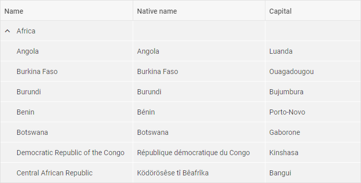
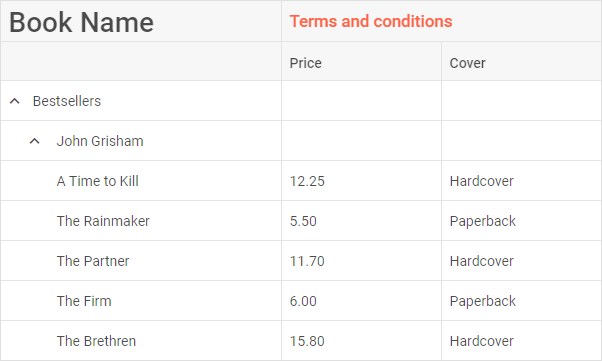
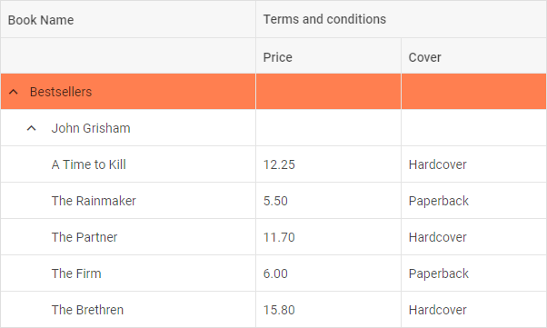
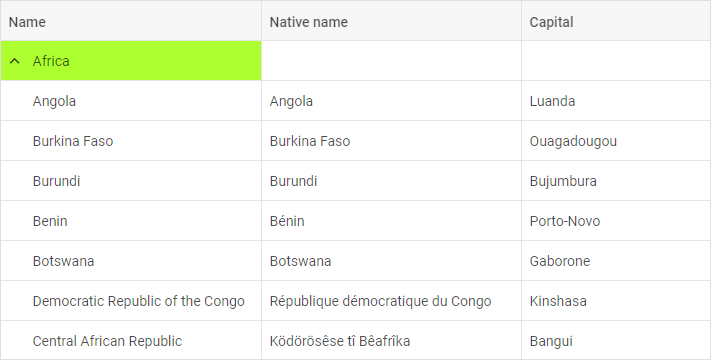
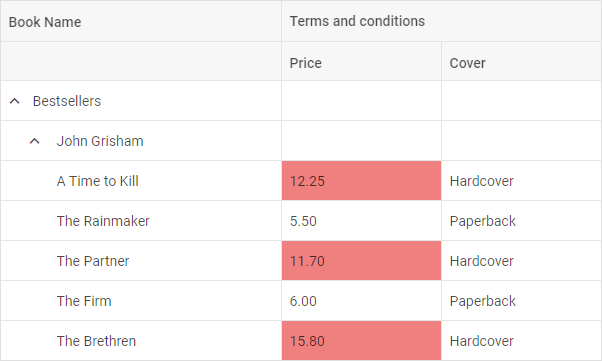
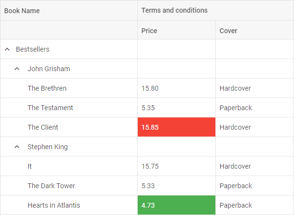
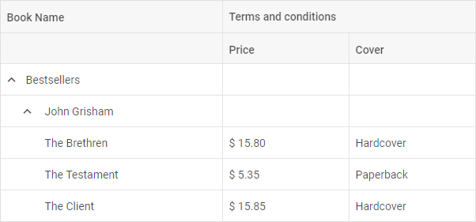

---
sidebar_label: Customization
title: Customization
---          

Styling TreeGrid
----------------

There is a possibility to make changes in the look and feel of a treegrid. 

{{editor	https://snippet.dhtmlx.com/cpvir0od	TreeGrid. Styling Grid}}

For this you need to take the following steps:

- add a new CSS class(es) with desired settings in the &lt;style&gt; section of your HTML page or in your file with styles (don't forget to include your file on the page in this case)

~~~html

~~~

- specify the name of the created CSS class (or names of classes separated by spaces) as the value of the [css](treegrid/api/treegrid_css_config.md) property in the TreeGrid configuration:

~~~js
var treegrid = new dhx.TreeGrid("treegrid_container", { 
    css:"my-first-class my-second-class"
});
~~~

Styling header cells
-------------------

{{editor	https://snippet.dhtmlx.com/vf0ws454	TreeGrid. Styling Header Cells}}

You can easily set some styling to the text of header cells by applying some inline style or a CSS class to the [text](treegrid/configuration.md#columns) property of the header of a column:

~~~js
var treegrid = new dhx.TreeGrid("treegrid_container", { 
	columns: [
		{ width: 280, id: "name", 
		  	header: [{ text: "Book Name" }] },
		{ width: 160, id: "price", type: "string", 
			header: [{ text: "Terms and conditions",
			colspan: 2 }, { text: "Price" }] },
		{ width: 160, id: "cover", type: "string", header: [{}, { text: "Cover" }] }
	],
	data: dataset
});
~~~

Styling footer cells
-------------------

{{editor	https://snippet.dhtmlx.com/wi39d42e	TreeGrid. Styling Footer Cells}}

You can easily set some styling to the text of footer cells by applying some inline style or a CSS class to the [text](treegrid/configuration.md#columns) property of the footer of a column:

~~~html

var treegrid = new dhx.TreeGrid("treegrid_container", { 
	columns: [
	  	{
			width: 280, id: "name", header: [{ text: "Book Name" }],
			footer: [
				{ text: '
Total
' },
				{ text: '
Minimal value
' }
			]
		},
		{
			width: 160, id: "price", type: "string", 
			header: [{ text: "Terms and conditions", colspan: 2 }, { text: "Price" }],
			footer: [{ content: "sum" }, { content: "min" }]
		},
		{ 
			width: 160, id: "cover", type: "string", 
			header: [{}, { text: "Cover" }] 
		}
	],
	data: dataset
});
~~~

Styling rows
---------------

It is possible to change the appearance of treegrid rows by applying custom CSS styles to them. 

{{editor	https://snippet.dhtmlx.com/3ojyoryn	TreeGrid. Custom Row Style}}

There are two ways to do it:

- via the **rowCss** property in the configuration of TreeGrid. As a value of property set a function that takes the id of a row as a parameter and returns a string with the name of a CSS class.

~~~html

~~~

~~~js
var treegrid = new dhx.TreeGrid("treegrid_container", { 
	columns: [// columns config],
	rowCss: function (row) { return row.custom ? "my_custom_row" : "" }, /*!*/
	data: dataset
});
~~~

- with the help of the [addRowCss()](treegrid/api/treegrid_addrowcss_method.md) method:

~~~html

~~~

~~~js
var rowId = treegrid.data.getId(1);
treegrid.addRowCss(rowId, "myCustomClass"); /*!*/
~~~

{{editor	https://snippet.dhtmlx.com/kort67nu	TreeGrid. Add row css}}

where:

<table class="webixdoc_links">
	<tbody>
        <tr>
			<td class="webixdoc_links0"><b>rowId</b></td>
			<td>(<i>string|number</i>) the id of a row</td>
		</tr>
		<tr>
			<td class="webixdoc_links0"><b>css</b></td>
			<td>(<i>string</i>) the name of a CSS class</td>
		</tr>
    </tbody>
</table>

Styling cells
----------------

{{editor	https://snippet.dhtmlx.com/smjecfzp	TreeGrid. Add cell css}}

It is easy to style necessary cells using the [addCellCss()](treegrid/api/treegrid_addcellcss_method.md) method. It takes three parameters:

<table class="webixdoc_links">
	<tbody>
        <tr>
			<td class="webixdoc_links0"><b>row</b></td>
			<td>(<i>string|number</i>) the id of a row</td>
		</tr>
		<tr>
			<td class="webixdoc_links0"><b>col</b></td>
			<td>(<i>string|number</i>) the id of a column</td>
		</tr>
		<tr>
			<td class="webixdoc_links0"><b>css</b></td>
			<td>(<i>string</i>) the name of the CSS class</td>
		</tr>
    </tbody>
</table>
 

~~~html

~~~

~~~js
treegrid.addCellCss(rowId, "name", "myCustomClass");
~~~

Adding custom marks to cells
-------------------

{{editor	https://snippet.dhtmlx.com/14jkc5s3	TreeGrid. Custom Mark Cells}}

You can mark particular cells in a treegrid using the **mark** property of a column configuration. You need to set its value as a function that takes the following parameters:

<table class="webixdoc_links">
	<tbody>
        <tr>
			<td class="webixdoc_links0"><b>cell</b></td>
			<td>(<i>string</i>) the value of a cell</td>
		</tr>
		<tr>
			<td class="webixdoc_links0"><b>columnCells</b></td>
			<td>(<i>array</i>) an array of all cell values in the specified column</td>
		</tr>
		<tr>
			<td class="webixdoc_links0"><b>row</b></td>
			<td>(<i>object</i>) an object with all cells in a row</td>
		</tr>
		<tr>
			<td class="webixdoc_links0"><b>col</b></td>
			<td>(<i>object</i>) the config of a column (see the columns config)</td>
		</tr>
    </tbody>
</table>

The function should return a string with a cusotm CSS class for your mark.

~~~html

~~~

~~~js
var treegrid = new dhx.TreeGrid("treegrid_container", { 
	columns: [
		{ width: 280, id: "name", header: [{ text: "Book Name" }] },
		{
			width: 160, id: "price", type: "string", 
			header: [
				{ text: "Terms and conditions", colspan: 2 }, 
				{ text: "Price" }
			],
			// marks specified cells in a column
			mark: function (cell, data, row, col) {  /*!*/
				return cell > 10 ? "my_custom_mark" : ""  /*!*/
			}
		},
		{ width: 160, id: "cover", type: "string", 
			header: [{}, { text: "Cover" }] },
		{ width: 160, id: "ships", type: "string", 
			header: [{ text: "Ships in" }],
			// marks all cells in a column
			mark: function (cell, data) { return "total_col"; } /*!*/
		},
		// more options			
	],
	data: dataset
});
~~~

It is also possible to highlight cells with minimum and (or) maximum values in a grid using the **mark** property of a column configuration. The property is an object which takes two optional parameters:

<table class="webixdoc_links">
	<tbody>
        <tr>
			<td class="webixdoc_links0"><b>min</b></td>
			<td>(<i>string</i>) a custom CSS class to mark a cell that contains the minimum value</td>
		</tr>
		<tr>
			<td class="webixdoc_links0"><b>max</b></td>
			<td>(<i>string</i>) a custom CSS class to mark a cell that contains the maximum value</td>
		</tr>
    </tbody>
</table>
 

~~~html

~~~

~~~js
var grid = new dhx.Grid("grid", {
	columns: [
		{ width: 280, id: "name", header: [{ text: "Book Name" }] },
		{
			width: 160, id: "price", type: "string", 
			header: [
				{ text: "Terms and conditions", colspan: 2 },
				{ text: "Price" }
			],
			mark: { /*!*/
				min: "min_cell", /*!*/
				max: "max_cell" /*!*/
			}
		},
		// more options
	],
	data: dataset
});
~~~

{{editor	https://snippet.dhtmlx.com/um9mjrs5	TreeGrid. Mark Cells}}

Adding template to cells
-----------------------------

It is possible to customize the content of cells of TreeGrid via the **template** property of a [column configuration](treegrid/configuration.md#columns). The template option is a function that takes three parameters:

<table class="webixdoc_links">
	<tbody>
        <tr>
			<td class="webixdoc_links0"><b>cellValue</b></td>
			<td>(<i>any</i>) the value of a cell</td>
		</tr>
		<tr>
			<td class="webixdoc_links0"><b>row</b></td>
			<td>(<i>object</i>) an object with all cells in a row</td>
		</tr>
		<tr>
			<td class="webixdoc_links0"><b>col</b></td>
			<td>(<i>object</i>) the config of a column</td>
		</tr>
    </tbody>
</table>
 

~~~js
var treeGrid = new dhx.TreeGrid("treegrid", {
	columns: [
		{ width: 280, id: "name", header: [{ text: "Book Name" }] },
		{ width: 160, id: "price", type: "string",
		 	header: [
				 { text: "Terms and conditions", colspan: 2 },
				  { text: "Price" }
			],
			template: function (text, row, col) { /*!*/
				return text?"$ "+text :""; /*!*/
			}
		},
		// more options 
	],
	data: dataset,
});
~~~

{{editor	https://snippet.dhtmlx.com/q76qcgn3	TreeGrid. Template with content for cells}}

<h3 id="eventhandling">Event handlers for the template</h3>

Starting from v7.0, you can assign event handlers to HTML elements of a custom template of TreeGrid cells via using the  configuration property of TreeGrid, for instance:

~~~js
const treeGrid = new dhx.TreeGrid("treegrid", {
	columns: [
		{ width: 280, id: "name", header: [{ text: "Book Name" }] },
		{
			width: 160, id: "price", type: "string", 
            header: [{ text: "Terms and conditions", colspan: 2 }, { text: "Price" }],
			htmlEnable: true,
			template: function (text, row, col) { /*!*/
				return text ? "
$ " + text + "
" : ""; /*!*/
			} /*!*/
		},
		// more options
	],
	data: data,
	eventHandlers: { /*!*/
		onmouseover: { /*!*/
			cell__template: function(event, data) { /*!*/
				display(JSON.stringify(data.row, null, 2)); /*!*/
			} /*!*/
		} /*!*/
	} /*!*/
});

~~~

[TreeGrid. Handling Events in Template](https://snippet.dhtmlx.com/la7u1xqy)

The **eventHandlers** object includes a set of *key:value* pairs, where:

<table class="webixdoc_links">
	<tbody>
        <tr>
			<td class="webixdoc_links0"><i>key</i></td>
			<td> the name of the event. Note, that at the beginning of the event name the <b>'on'</b> prefix is used (onclick, onmouseover).</td>
		</tr>
        <tr>
			<td class="webixdoc_links0"><i>value</i></td>
			<td>an object that contains a <i>key:value</i> pair, where <i>key</i> is the css class name that the handler will be applied to and <i>value</i> is a function that takes two parameters:
            <ul>
                <li><b>event</b> - an event object</li>
                <li><b>object</b> - an object with two attributes:
                <ol>- <b>row</b> - an object with a row configuration</ol>
                <ol>- <b>column</b> - an object with a column configuration</ol></li>
            </ul></td>
		</tr>
    </tbody>
</table>

