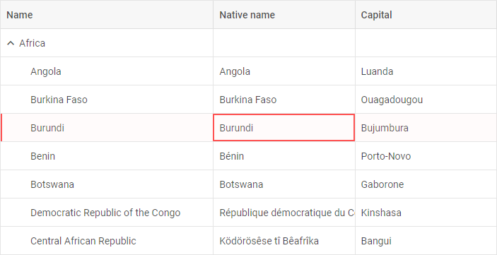
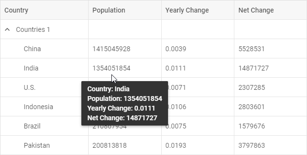

# Customization

## Styling TreeGrid

There is a possibility to make changes in the look and feel of a treegrid. 

**Related sample**: [TreeGrid. Styling (custom CSS)](https://snippet.dhtmlx.com/cpvir0od)

For this you need to take the following steps:

- add a new CSS class(es) with desired settings in the &lt;style&gt; section of your HTML page or in your file with styles (don't forget to include your file on the page in this case)

~~~html

~~~

- specify the name of the created CSS class (or names of classes separated by spaces) as the value of the [css](treegrid/api/treegrid_css_config.md) property in the TreeGrid configuration:

~~~js
const treegrid = new dhx.TreeGrid("treegrid_container", { 
    css:"my-first-class my-second-class"
});
~~~

For example:

~~~html

~~~

## Styling selection

**Related sample**: [TreeGrid. Styling selection (custom CSS)](https://snippet.dhtmlx.com/tejgztxd)

Here is an example of how you can style selection in TreeGrid:

~~~html

~~~

## Styling header cells

**Related sample**: [TreeGrid. Styling header cells (custom CSS)](https://snippet.dhtmlx.com/vf0ws454)

You can easily set some styling to the text of header cells by applying some inline style or a CSS class to the [text](treegrid/api/api_treegridcolumn_properties.md) property of the header of a column:

~~~js
const treegrid = new dhx.TreeGrid("treegrid_container", { 
	columns: [
		{ width: 280, id: "name", 
		  	header: [{ text: "Book Name" }] },
		{ width: 160, id: "price", type: "string", 
			header: [{ text: "Terms and conditions",
			colspan: 2 }, { text: "Price" }] },
		{ width: 160, id: "cover", type: "string", header: [{}, { text: "Cover" }] }
	],
	data: dataset
});
~~~

## Styling footer cells

**Related sample**: [TreeGrid. Styling footer cells (custom CSS)](https://snippet.dhtmlx.com/wi39d42e)

You can easily set some styling to the text of footer cells by applying some inline style or a CSS class to the [text](treegrid/api/api_treegridcolumn_properties.md) property of the footer of a column:

~~~html

~~~

## Styling rows

It is possible to change the appearance of treegrid rows by applying custom CSS styles to them. 

**Related sample**: [TreeGrid. Custom row style](https://snippet.dhtmlx.com/3ojyoryn)

There are two ways to do it:

- via the **rowCss** property in the configuration of TreeGrid. As a value of property set a function that takes the id of a row as a parameter and returns a string with the name of a CSS class.

~~~html {12}

~~~

- with the help of the [addRowCss()](treegrid/api/treegrid_addrowcss_method.md) method:

~~~html {10}

~~~

**Related sample**: [TreeGrid. Add row CSS](https://snippet.dhtmlx.com/kort67nu)

where:

<table>
	<tbody>
        <tr>
			<td><b>rowId</b></td>
			<td>(<i>string|number</i>) the id of a row</td>
		</tr>
		<tr>
			<td><b>css</b></td>
			<td>(<i>string</i>) the name of a CSS class</td>
		</tr>
    </tbody>
</table>

## Styling cells

**Related sample**: [TreeGrid. Add cell CSS](https://snippet.dhtmlx.com/smjecfzp)

It is easy to style necessary cells using the [addCellCss()](treegrid/api/treegrid_addcellcss_method.md) method. It takes three parameters:

<table>
	<tbody>
        <tr>
			<td><b>row</b></td>
			<td>(<i>string|number</i>) the id of a row</td>
		</tr>
		<tr>
			<td><b>col</b></td>
			<td>(<i>string|number</i>) the id of a column</td>
		</tr>
		<tr>
			<td><b>css</b></td>
			<td>(<i>string</i>) the name of the CSS class</td>
		</tr>
    </tbody>
</table>
 

~~~html

~~~

## Adding custom marks to cells

**Related sample**: [TreeGrid. Custom mark cells](https://snippet.dhtmlx.com/14jkc5s3)

You can mark particular cells in a treegrid using the **mark** property of a column configuration. You need to set its value as a function that takes the following parameters:

<table>
	<tbody>
        <tr>
			<td><b>cell</b></td>
			<td>(<i>string</i>) the value of a cell</td>
		</tr>
		<tr>
			<td><b>columnCells</b></td>
			<td>(<i>array</i>) an array of all cell values in the specified column</td>
		</tr>
		<tr>
			<td><b>row</b></td>
			<td>(<i>object</i>) an object with all cells in a row</td>
		</tr>
		<tr>
			<td><b>col</b></td>
			<td>(<i>object</i>) the config of a column (see the columns config)</td>
		</tr>
    </tbody>
</table>

The function should return a string with a cusotm CSS class for your mark.

~~~html {22-24,31}

~~~

It is also possible to highlight cells with minimum and (or) maximum values in a grid using the **mark** property of a column configuration. The property is an object which takes two optional parameters:

<table>
	<tbody>
        <tr>
			<td><b>min</b></td>
			<td>(<i>string</i>) a custom CSS class to mark a cell that contains the minimum value</td>
		</tr>
		<tr>
			<td><b>max</b></td>
			<td>(<i>string</i>) a custom CSS class to mark a cell that contains the maximum value</td>
		</tr>
    </tbody>
</table>
 

~~~html {23-26}

~~~

**Related sample**: [TreeGrid. Mark cells](https://snippet.dhtmlx.com/um9mjrs5)

## Adding template to cells

It is possible to customize the content of cells of TreeGrid via the **template** property of a [column configuration](treegrid/configuration.md#columns). The template option is a function that takes three parameters:

<table>
	<tbody>
        <tr>
			<td><b>cellValue</b></td>
			<td>(<i>any</i>) the value of a cell</td>
		</tr>
		<tr>
			<td><b>row</b></td>
			<td>(<i>object</i>) an object with all cells in a row</td>
		</tr>
		<tr>
			<td><b>col</b></td>
			<td>(<i>object</i>) the config of a column</td>
		</tr>
    </tbody>
</table>
 

~~~js {9-11}
const treeGrid = new dhx.TreeGrid("treegrid_container", {
	columns: [
		{ width: 280, id: "name", header: [{ text: "Book Name" }] },
		{ width: 160, id: "price", type: "string",
		 	header: [
				 { text: "Terms and conditions", colspan: 2 },
				  { text: "Price" }
			],
			template: function (text, row, col) {
				return text?"$ "+text :"";
			}
		},
		// more options 
	],
	data: dataset,
});
~~~

**Related sample**: [TreeGrid. Template with content for cells](https://snippet.dhtmlx.com/q76qcgn3)

### Event handlers for the template

Starting from v7.0, you can assign event handlers to HTML elements of a custom template of TreeGrid cells via using the  configuration property of TreeGrid, for instance:

~~~js {8-10,15-21}
const treeGrid = new dhx.TreeGrid("treegrid_container", {
	columns: [
		{ width: 280, id: "name", header: [{ text: "Book Name" }] },
		{
			width: 160, id: "price", type: "string", 
            header: [{ text: "Terms and conditions", colspan: 2 }, { text: "Price" }],
			htmlEnable: true,
			template: function (text, row, col) {
				return text ? "
$ " + text + "
" : "";
			}
		},
		// more options
	],
	data: data,
	eventHandlers: {
		onmouseover: {
			cell__template: function(event, data) {
				console.log(JSON.stringify(data.row, null, 2));
			}
		}
	}
});
~~~

**Related sample**: [TreeGrid. Handling events in template](https://snippet.dhtmlx.com/la7u1xqy)

## Adding template to tooltip

Starting with v7.1, you can customize the content of the tooltip of a column via the [tooltipTemplate](treegrid/api/api_treegridcolumn_properties.md) configuration option of the column. The **tooltipTemplate** function takes three parameters:

<table>
	<tbody>
        <tr>
			<td><b>value</b></td>
			<td>(<i>any</i>) the value of a cell</td>
		</tr>
		<tr>
			<td><b>row</b></td>
			<td>(<i>object</i>) an object with all cells in a row</td>
		</tr>
		<tr>
			<td><b>col</b></td>
			<td>(<i>object</i>) the config of a column</td>
		</tr>
    </tbody>
</table>
 

~~~js {1-9,15,19}
function rowDataTemplate(value, row, col) {
    if (!value) {
        return;
    }
    return `Country: ${row.country} 
            Population: ${row.population} 
            Yearly Change: ${row.yearlyChange} 
            Net Change: ${row.netChange}`;
}

const treeGrid = new dhx.TreeGrid("treegrid_container", {
    columns: [
        { 
			id: "country", header: [{ text: "Country" }], gravity: 1.2, 
			tooltipTemplate: rowDataTemplate
		},
        { 
			id: "population", header: [{ text: "Population" }], 
			tooltipTemplate: rowDataTemplate
		},
        // more options
    ],
    data: dataset
});
~~~

**Related sample**: [TreeGrid. Tooltip template](https://snippet.dhtmlx.com/520i6vbt)

{{note You should enable the [htmlEnable](treegrid/configuration.md#html-content-of-treegrid-columns) option in the configuration of TreeGrid (or configuration of the column) to activate HTML support for the tooltip.}}
