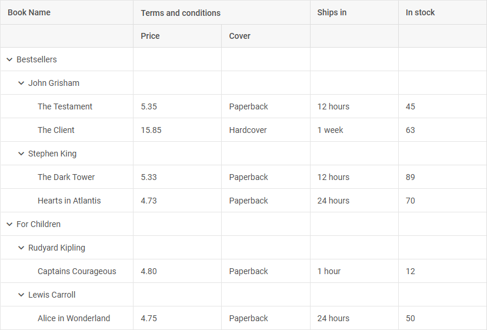

---
sidebar_label: Overview
title: TreeGrid overview
description: dhtmlxTreeGrid is a special extension of dhtmlxGrid component for showing and editing tabular data in a hierarchical tree-like structure.

---          

{{pronote
The TreeGrid component is available in the **PRO** version only.
}}

dhtmlxTreeGrid is a special extension for [dhtmlxGrid](grid/index.md). This component allows showing the nested tabular data. Being a successor of Grid, TreeGrid inherits its API and common techniques of initialization and
usage. 

Check [online samples for dhtmlxTreeGrid](https://docs.dhtmlx.com/suite/samples/treegrid/).

## API Reference

- 

## Related resources

- To get just dhtmlxTreeGrid, download it from [our website](https://dhtmlx.com/docs/products/dhtmlxTreeGrid/download.shtml)
- To get the whole JavaScript library of UI components [download dhtmlxSuite](https://dhtmlx.com/docs/products/dhtmlxSuite/download.shtml)          
- There are also [online samples for dhtmlxTreeGrid](https://docs.dhtmlx.com/suite/samples/treegrid/)  

## Guides

- 
- 
- 
- 
- 
- 
- 

## Other

- 
