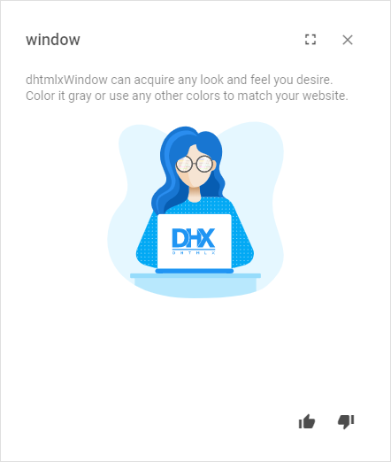
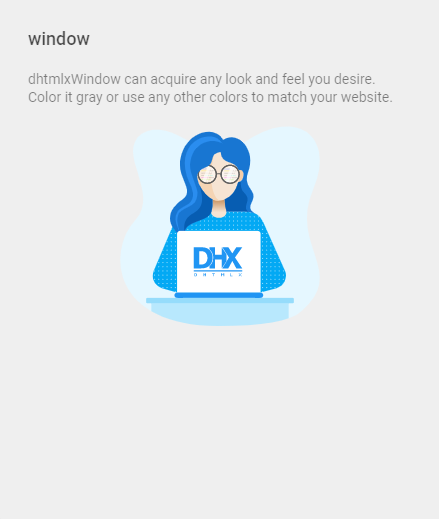

---
sidebar_label: Customization
title: Customization
---          

You can customize the look and feel of the header and footer of Window together with their functionality.

Default and custom icons
----------

dhtmlxWindow uses the [Material Design](https://materialdesignicons.com/)-based icons by default. However, you can use any other icon font pack, if necessary. For this, you need to include the desired icon font on 
a page and apply icons in any possible part of the window: in the header or the footer.

For example, you can use the [Font Awesome](https://fontawesome.com/) icon pack by including [link to its CDN](https://fontawesome.com/how-to-use/on-the-web/setup/getting-started?using=web-fonts-with-css) 
after the source files of dhtmlxWindow as follows:

~~~html

<link rel="stylesheet" href="../../codebase/window.css">

<link rel="stylesheet" href="https://use.fontawesome.com/releases/v5.3.1/css/all.css" 
  integrity="sha384-mzrmE5qonljUremFsqc01SB46JvROS7bZs3IO2EmfFsd15uHvIt+Y8vEf7N7fWAU"  
  crossorigin="anonymous">
~~~

Then you can use the name of the icon as the value of the **icon** property in the object with the control parameters for the header or the footer. [See details below](window/customization.md#updatecontrols).

{{editor	https://snippet.dhtmlx.com/ucozvx01	Window. Custom Icons}}

Controls and operations
----------------------

It is possible to add any Toolbar controls into the header/footer of a window.
You can work with controls in the header/footer of a window in the same way as with  controls, i.e. add new controls, delete unnecessary ones and update the settings of controls, e.g. labels and icons.

### Adding controls 

Besides initial controls, you can add other controls into the header/footer on the fly. 

For this, you should apply the  method of Data Collection. It takes the parameters below:

<table class="webixdoc_links">
	<tbody>
        <tr>
			<td class="webixdoc_links0"><b>config</b></td>
			<td>(<i>object</i>) the configuration object of the added control</td>
		</tr>
        <tr>
			<td class="webixdoc_links0"><b>index</b></td>
			<td>(<i>number</i>) optional, the position to add a control at</td>
		</tr>
        <tr>
			<td class="webixdoc_links0"><b>parent</b></td>
			<td>(<i>string</i>) optional, the id of a parent control (for the <i>menuItem</i> control type)</td>
		</tr>
    </tbody>
</table>
 

~~~js
dhxWindow.header.data.add({icon: "mdi mdi-fullscreen", id: "fullscreen"}, 2);
dhxWindow.footer.data.add({type: "spacer"});
dhxWindow.footer.data.add({icon: "mdi mdi-thumb-up", id: "like"});
dhxWindow.footer.data.add({icon: "mdi mdi-thumb-down", id: "dislike"})
~~~

{{editor	https://snippet.dhtmlx.com/o7xlvvv3	Window. Custom Buttons}}

<h3 id="updatecontrols"> Updating controls </h3> 

You can change the icon of the Window control and its other config options with the help of the  method of Data Collection. It takes two parameters: 

- the id of an icon button
- an object with a new configuration of the control

~~~js
dhxWindow.header.data.update("close", {
	// using FA icon for the Close button
	icon: "fas fa-times" 
});
~~~

{{editor	https://snippet.dhtmlx.com/ucozvx01	Window. Custom Icons}}

### Deleting controls

To remove a control from the header/footer, make use of the  method of Data Collection. Pass the id of the control that should be removed to the method:

~~~js
dhxWindow.footer.data.remove("accept");
~~~

Styling 
-----------

There is a possibility to make changes in the look and feel of a window. 

{{editor	https://snippet.dhtmlx.com/t5mvhwx8	Window. Custom Styles}}

For this you need to take the following steps:

- add a new CSS class(es) with desired settings in the &lt;style&gt; section of your HTML page or in your file with styles (don't forget to include your file on the page in this case)

~~~html

~~~

- specify the name of the created CSS class (or names of classes separated by spaces) as the value of the  property in the Window configuration:

~~~js
var dhxWindow = new dhx.Window({
	title: "Window", 
    css:"my-first-class my-second-class"
});
dhxWindow.show();
~~~

