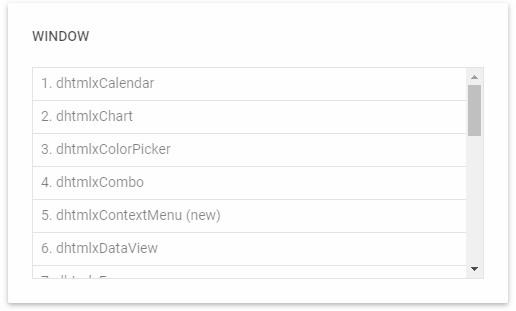

---
sidebar_label: Overview
title: Window overview
description: dhtmlxWindow is a JavaScript component for adding easy-to-use windows to applications. The component possesses rich configuration possibilities and provides a lot of means for creating attractive windows that have the desktop functionality.
---          

dhtmlxWindow allows working with several windows and their content at the same time. The component provides means for performing standard operations with windows, 
such as moving/resizing a window, sending a window to the foreground/background, making a window modal, changing position and size of a window, setting content inside a window, etc.
Check [online samples for dhtmlxWindow](https://docs.dhtmlx.com/suite/samples/window/).

## API reference

- 

## Related resources

- You can get dhtmlxWindow as a part of the Suite library by [downloading dhtmlxSuite](https://dhtmlx.com/docs/products/dhtmlxSuite/download.shtml)          
- There are also [online samples for dhtmlxWindow](https://docs.dhtmlx.com/suite/samples/window/)

## Guides

- 	
- 
- 
- 
- 

## Other

- 
